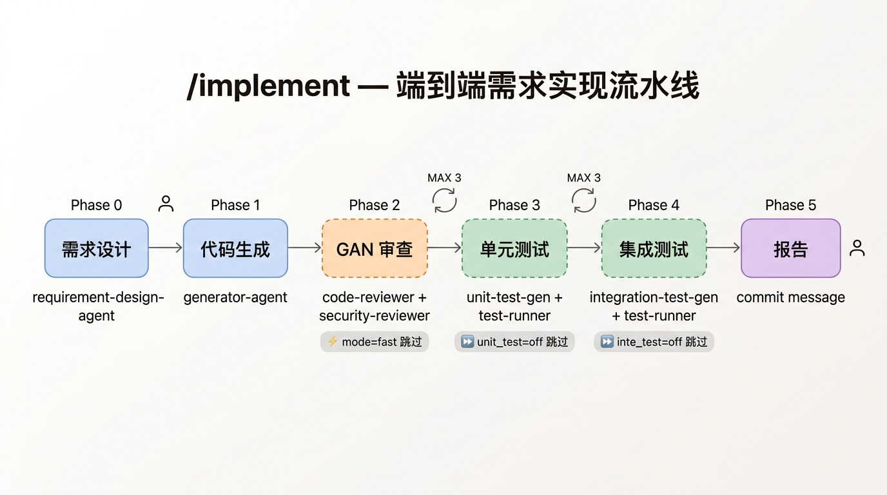
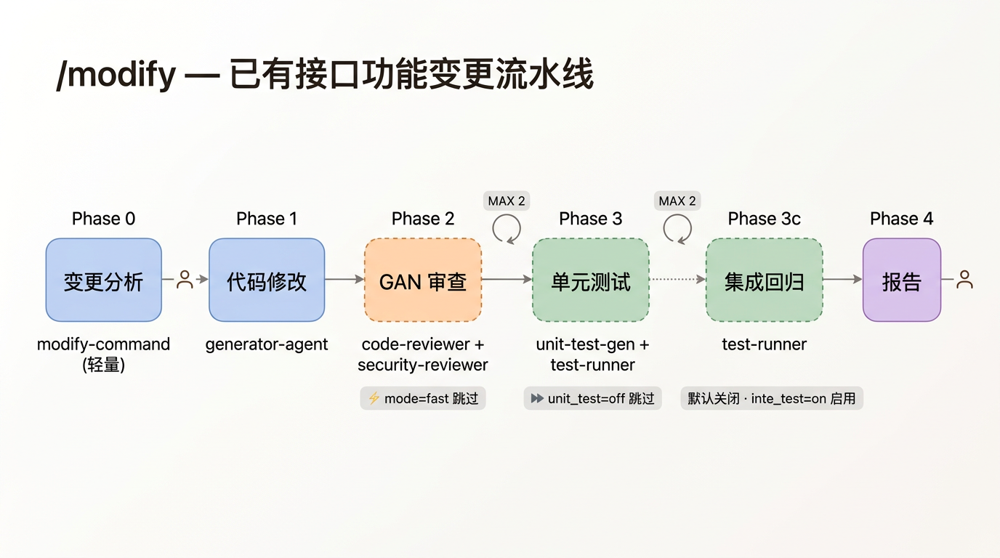
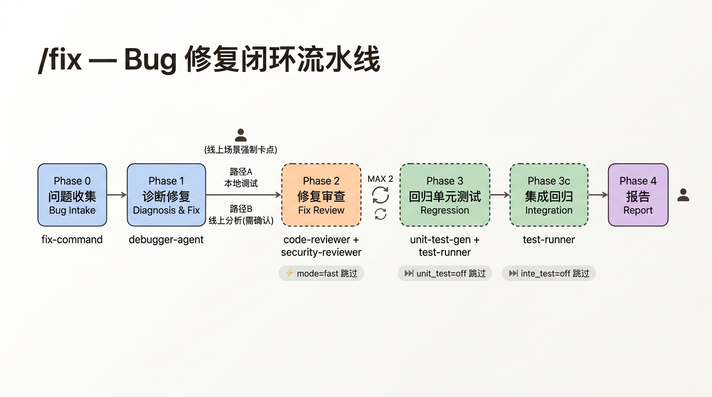
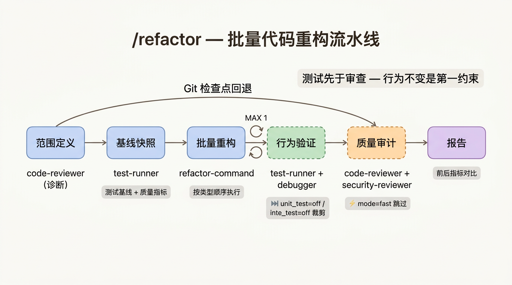

# 命令全解

Fast-Harness 提供四个核心命令，覆盖开发全生命周期。每个命令都是一条独立的 AI 流水线，内部由多个 Sub-agent 按 GAN（生成-鉴别）架构协作，通过文件契约传递状态。

**选择指南**：

| 场景 | 命令 | 一句话 |
|------|------|--------|
| 全新接口/功能 | `/implement` | 从需求到可提交代码的端到端流水线 |
| 已有接口行为变更 | `/modify` | 轻量分析 → 精准修改 → 单元测试 |
| Bug 修复 | `/fix` | 问题收集 → 诊断修复 → 回归验证 |
| 结构优化 | `/refactor` | 基线快照 → 批量重构 → 行为等价验证 |

**通用流水线控制参数**（四个命令统一支持）：

| 参数 | 取值 | 作用 |
|------|------|------|
| `mode` | `full`（默认）/ `fast` | `fast` 跳过 GAN 审查/质量审计，省 20-40% Token |
| `unit_test` | `on`（默认）/ `off` / `<router>` | 控制单元测试开关；传 **router 目录名**（`tests/<router>/`）可限定单元测试范围 |
| `inte_test` | `on` 或 `off`（视命令）/ `<module>` | 控制集成测试开关，传模块名可限定测试范围 |

---

## 1. /implement — 端到端需求实现流水线



### 命令格式

```bash
# 方式一：直接描述需求（触发 Phase 0 需求设计）
/implement <需求描述> [module=xxx] [xmind=/path/to/xxx.xmind] [mode=fast] [unit_test=off] [inte_test=off]

# 方式二：从已有 task_card 继续（跳过 Phase 0）
/implement task_card=<path> [xmind=...] [mode=fast] [unit_test=off] [inte_test=off]
```

### 参数说明

**输入参数**

| 参数 | 必填 | 说明 |
|------|------|------|
| 需求描述 | 二选一 | 自然语言需求，触发 Phase 0 需求设计 |
| `task_card` | 二选一 | 已有 `task_card.json` 路径，跳过 Phase 0 |

**上下文参数**

| 参数 | 默认值 | 说明 |
|------|--------|------|
| `module` | 自动推断 | 模块名，用于文件命名和测试定位 |
| `xmind` | - | xmind 测试用例路径，用于 Phase 4 集成测试 |

**流水线控制**

| 参数 | 默认值 | 说明 |
|------|--------|------|
| `mode` | `full` | `fast` 跳过 Phase 2 GAN 审查（省 30-40% Token） |
| `unit_test` | `on` | `off` 跳过 Phase 3；`<router>` 仅跑 `tests/<router>/` |
| `inte_test` | `on` | `off` 跳过 Phase 4；`<module>` 限定测试范围 |

### 使用示例

```bash
# 完整流水线
/implement 新增用户积分兑换接口，支持积分抵扣和混合支付 module=points xmind=tests/points_cases.xmind

# 快速模式：跳过审查，只要测试通过就行
/implement 新增导出 CSV 功能 module=export mode=fast

# 最小模式：只生成代码，不跑测试
/implement 添加健康检查端点 module=health mode=fast unit_test=off inte_test=off

# 从已有设计继续
/implement task_card=.ai/implement/feature_points/task_card.json
```

### Phase 详解

| Phase | 名称 | Agent | 可跳过 | 关键产出 |
|-------|------|-------|--------|----------|
| 0 | 需求设计 | requirement-design-agent | `task_card` 跳过 | `task_card.json` + 设计文档 |
| 1 | 代码生成 | generator-agent | - | 实现代码 + `changed_files.txt` |
| 2 | GAN 审查 | code-reviewer + security-reviewer | `mode=fast` | `review_feedback.md` |
| 3 | 单元测试 | unit-test-gen + test-runner | `unit_test=off` | `unit_test_results.md` |
| 4 | 集成测试 | integration-test-gen + test-runner | `inte_test=off` | `integration_test_results.md` |
| 5 | 报告 | - | - | 执行报告 + commit message |

**Phase 0 需求设计**：8 步渐进式设计（需求理解 → 技术方案 → DB 设计 → API 设计 → 业务逻辑 → 侵入性检查 → task_card → 设计文档），每步均有 AskQuestion 人类确认门控。

**Phase 2 GAN 审查**：Code Reviewer（架构合规/圈复杂度/重复代码/测试缺口/代码正确性/编程实践 六维度）+ Security Reviewer（SQL 注入/鉴权绕过/敏感泄露/命令注入/依赖安全 五维度）并行评判。任一 FAIL → Debugger 修复 → 重审（MAX 3 轮）。

**Phase 3/4 测试**：基于本地 MySQL 真实数据生成测试参数，FAIL → Debugger 修复代码（不改测试）→ 重跑（MAX 3 轮）。

### 报告示例

```markdown
## 🏁 implement 流水线执行报告

| 阶段 | Agent | VERDICT | 重试 |
|------|-------|---------|------|
| Phase 0: 需求设计 | requirement-design-agent | ✅ | - |
| Phase 1: 代码生成 | generator-agent | ✅ | - |
| Phase 2: 代码审查 | code-reviewer + security-reviewer | PASS | 1 |
| Phase 3: 单元测试 | unit-test-gen + test-runner | PASS | 0 |
| Phase 4: 集成测试 | integration-test-gen + test-runner | PASS | 0 |

改动文件：asset_router.py, asset_transfer_service.py, asset_transfer.py
测试覆盖：单元 6 例 + 集成 8 例
```

---

## 2. /modify — 已有接口功能变更流水线



### 命令格式

```bash
# 方式一：描述变更需求
/modify <变更描述> [module=xxx] [from=implement] [mode=fast] [unit_test=off] [inte_test=on]

# 方式二：从已有 change_card 继续
/modify change_card=<path> [mode=fast] [unit_test=off] [inte_test=on]
```

### 参数说明

**输入参数**

| 参数 | 必填 | 说明 |
|------|------|------|
| 变更描述 | 二选一 | 自然语言变更需求，触发 Phase 0 |
| `change_card` | 二选一 | 已有 `change_card.json` 路径，跳过 Phase 0 |

**上下文参数**

| 参数 | 默认值 | 说明 |
|------|--------|------|
| `module` | 自动推断 | 模块名 |
| `from` | - | `implement` 时从 `task_card.json` 导入接口上下文 |

**流水线控制**

| 参数 | 默认值 | 说明 |
|------|--------|------|
| `mode` | `full` | `fast` 跳过 Phase 2 GAN 审查 |
| `unit_test` | `on` | `off` 跳过 Phase 3；`<router>` 仅跑 `tests/<router>/` |
| `inte_test` | **`off`** | `on` 启用已有集成测试回归（Phase 3c）；默认关闭 |

> **与 implement 的关键区别**：`inte_test` 默认 `off`。modify 是局部变更，通常无需集成测试。

### 使用示例

```bash
# 标准变更
/modify 转账接口增加手续费字段，fee_rate 精度为万分之一 module=transfer

# 快速变更：跳过审查
/modify 用户列表增加排序参数 module=user mode=fast

# 从 implement 衔接（复用接口上下文）
/modify 调整积分兑换比例校验逻辑 from=implement module=points

# 变更后顺带跑集成测试回归
/modify 修改响应体分页格式 module=asset inte_test=on
```

### Phase 详解

| Phase | 名称 | Agent | 可跳过 | 关键产出 |
|-------|------|-------|--------|----------|
| 0 | 变更分析 | modify-command（轻量） | `change_card` 跳过 | `change_card.json` |
| 1 | 代码修改 | generator-agent | - | 修改代码 + `changed_files.txt` |
| 2 | GAN 审查 | code-reviewer + security-reviewer | `mode=fast` | `review_feedback.md` |
| 3 | 单元测试 | unit-test-gen + test-runner | `unit_test=off` | `unit_test_results.md` |
| 3c | 集成回归 | test-runner | 默认跳过，`inte_test=on` 启用 | `integration_test_results.md` |
| 4 | 报告 | - | - | 执行报告 + commit message |

**Phase 0 轻量分析**：无需 Sub-agent。自动定位目标接口 → 沿调用链追踪（router → service → dao → schema）→ 影响分析 → 生成 `change_card.json`（含现状快照、目标变更、向后兼容性、风险等级）。

**Phase 1 精准修改**：只改 `target_changes` 声明的变更点，`backward_compatibility` 为不兼容时在代码标注 `BREAKING CHANGE`。

**Retry 上限**：GAN/测试修复各 MAX 2 轮（比 implement 的 3 轮更严格，局部变更超 2 轮说明方案本身有问题）。

---

## 3. /fix — Bug 修复闭环流水线



### 命令格式

```bash
# 方式一：直接描述 Bug
/fix <Bug 描述> [module=xxx] [mode=fast] [unit_test=off] [inte_test=off]

# 方式二：从 implement 失败结果衔接
/fix from=implement [module=xxx] [mode=fast] [unit_test=off]

# 方式三：从已有 bug_report 继续
/fix bug_report=<path> [mode=fast] [unit_test=off] [inte_test=off]
```

### 参数说明

**输入参数**

| 参数 | 必填 | 说明 |
|------|------|------|
| Bug 描述 | 三选一 | 自然语言 Bug 描述，触发 Phase 0 |
| `from` | 三选一 | `implement` 时从失败结果自动生成 `bug_report.md` |
| `bug_report` | 三选一 | 已有 `bug_report.md` 路径，跳过 Phase 0 |

**上下文参数**

| 参数 | 默认值 | 说明 |
|------|--------|------|
| `module` | 自动推断 | 模块名 |

**流水线控制**

| 参数 | 默认值 | 说明 |
|------|--------|------|
| `mode` | `full` | `fast` 跳过 Phase 2 修复审查。**不建议在线上异常使用** |
| `unit_test` | `on` | `off` 跳过回归单元测试；`<router>` 仅跑 `tests/<router>/` |
| `inte_test` | `on` | `off` 跳过集成回归；`on` 在测试文件存在时自动触发 |

### Bug 来源自动识别

| 来源 | 输入特征 | 自动行为 |
|------|----------|----------|
| 测试失败 | `VERDICT: FAIL` / `*_test_results.md` | 提取失败用例 |
| 审查反馈 | `review_feedback.md` / Critical 关键词 | 提取 Critical 项 |
| 线上异常 | `request_id` / 环境名 | 标记需 Loki 日志 + DB 比对 |
| 手动报告 | 其他自然语言 | 请求用户补充复现步骤 |

### 使用示例

```bash
# 直接描述 Bug
/fix 积分扣减精度丢失，0.1+0.2!=0.3 module=points

# 从 implement 失败衔接
/fix from=implement module=transfer

# 线上 Bug 修复（建议保留完整审查）
/fix 线上转账超时 request_id=abc123 环境=drama-prod module=transfer

# 快速修复低风险问题
/fix 日志格式错误 module=common mode=fast inte_test=off
```

### Phase 详解

| Phase | 名称 | Agent | 可跳过 | 关键产出 |
|-------|------|-------|--------|----------|
| 0 | 问题收集 | fix-command | `bug_report` 跳过 | `bug_report.md` |
| 1 | 诊断修复 | debugger-agent | - | `diagnosis.md` + `changed_files.txt` |
| 2 | 修复审查 | code-reviewer + security-reviewer | `mode=fast` | `review_feedback.md` |
| 3 | 回归单元测试 | unit-test-gen + test-runner | `unit_test=off` | `regression_test_results.md` |
| 3c | 集成回归 | test-runner | `inte_test=off` | 追加到回归结果 |
| 4 | 报告 | - | - | 执行报告 + commit message |

**Phase 1 双路径诊断**：
- **路径 A（本地场景）**：测试失败/审查反馈/手动报告 → Debugger 直接调试修复
- **路径 B（线上场景）**：先 Plan 模式分析根因 → **强制人类确认** → 再执行修复

**Phase 3 回归测试**：生成「修复验证用例」（原 Bug 已修复）+ 「回归保护用例」（相邻功能未破坏），标记 `@pytest.mark.fix`。

**核心原则**：最小化修复 — 只改根因代码，不重构、不改风格、不扩大范围。证据驱动 — 禁止"试错式"修改。

---

## 4. /refactor — 批量代码重构流水线



### 命令格式

```bash
# 方式一：描述重构目标
/refactor <重构目标描述> [module=xxx] [scope=app/services/] [mode=fast] [unit_test=off] [inte_test=off]

# 方式二：从 implement 审查反馈衔接
/refactor from=implement [module=xxx] [mode=fast] [unit_test=off]

# 方式三：从已有计划继续
/refactor plan=<path> [mode=fast] [unit_test=off] [inte_test=off]
```

### 参数说明

**输入参数**

| 参数 | 必填 | 说明 |
|------|------|------|
| 重构目标描述 | 三选一 | 自然语言重构意图，触发 Phase 0 诊断扫描 |
| `from` | 三选一 | `implement` 时从审查反馈提取 Improvements/Nitpicks |
| `plan` | 三选一 | 已有 `refactor_plan.md` 路径，跳过 Phase 0 |

**上下文参数**

| 参数 | 默认值 | 说明 |
|------|--------|------|
| `module` | 自动推断 | 模块名 |
| `scope` | - | 限定扫描范围（目录或文件路径），缩小诊断边界 |

**流水线控制**

| 参数 | 默认值 | 说明 |
|------|--------|------|
| `mode` | `full` | `fast` 跳过 Phase 4 质量审计（省 20-30% Token），**行为验证仍执行** |
| `unit_test` | `on` | `off` 跳过 Phase 1/3 单元测试基线与验证；`<router>` 仅针对 `tests/<router>/` |
| `inte_test` | `on` | `off` 跳过 Phase 1/3 集成测试基线与验证 |

> **与其他命令的关键区别**：`mode=fast` 跳过的是 Phase 4（质量审计），而非 Phase 2（审查）。因为重构的核心约束是**行为不变**，验证不可跳过，审计可以省。

### 重构类型执行顺序

按固定顺序执行，先修正结构再动逻辑，最后改命名：

| 顺序 | 类型 | 说明 |
|------|------|------|
| 1 | `restructure` | 修复架构违规，恢复层级依赖方向 |
| 2 | `move` | 调整代码归属层级或模块 |
| 3 | `extract` | 提取大函数/重复逻辑 |
| 4 | `deduplicate` | 合并重复代码为公共组件 |
| 5 | `simplify` | 降低圈复杂度，消除冗余分支 |
| 6 | `rename` | 统一命名规范 |

### 使用示例

```bash
# 目标驱动重构
/refactor 将 asset_service.py 中超过 50 行的函数提取为独立函数 scope=app/services/

# 从 implement 审查反馈衔接
/refactor from=implement module=transfer

# 低风险重构快速模式（跳过质量审计）
/refactor 统一命名规范 snake_case scope=app/dao/ mode=fast

# 只验证单元测试基线，跳过集成
/refactor 消除跨层引用 scope=app/routers/ inte_test=off
```

### Phase 详解

| Phase | 名称 | Agent | 可跳过 | 关键产出 |
|-------|------|-------|--------|----------|
| 0 | 范围定义 | code-reviewer（诊断扫描） | `plan` 跳过 | `refactor_plan.md` |
| 1 | 基线快照 | test-runner | unit_test/inte_test 裁剪 | `baseline_snapshot.md` |
| 2 | 批量重构 | refactor-command | - | `changed_files.txt` |
| 3 | 行为验证 | test-runner + debugger | unit_test/inte_test 裁剪 | `behavior_test_results.md` |
| 4 | 质量审计 | code-reviewer + security-reviewer | `mode=fast` | `review_feedback.md` |
| 5 | 报告 | - | - | 前后指标对比 + commit message |

**Phase 1 基线快照**：运行已有测试记录 PASS/FAIL 状态 + 采集圈复杂度/架构合规指标。基线 PASS 的用例重构后必须 PASS，FAIL 不得恶化。

**Phase 3 行为验证**：与 Phase 1 完全一致的测试范围，严格验证行为等价。FAIL → Debugger 只调整重构实现（不改测试断言）→ MAX 2 轮。

**Phase 4 质量审计**：审计不强阻塞 — FAIL 不阻断提交（行为已验证），但报告中显著标注。循环仅 1 轮。

**Git 安全检查点**：重构前记录 `HEAD`，随时可通过 `git checkout` 一键回退所有改动。

---

## 四命令对比速查

### 定位区分

| 维度 | implement | modify | fix | refactor |
|------|-----------|--------|-----|----------|
| **核心目标** | 从零实现新功能 | 变更已有接口行为 | 修复 Bug | 改善代码结构 |
| **行为变化** | 新增行为 | 修改行为 | 修正行为 | 行为不变 |
| **Phase 0 重量级** | 重（8 步设计） | 轻（接口定位+影响分析） | 中（问题结构化） | 中（诊断扫描） |
| **上下文文件** | task_card.json | change_card.json | bug_report.md | refactor_plan.md |

### 流水线差异

| 维度 | implement | modify | fix | refactor |
|------|-----------|--------|-----|----------|
| `mode=fast` 跳过 | GAN 审查 | GAN 审查 | 修复审查 | 质量审计 |
| `inte_test` 默认 | `on` | **`off`** | `on` | `on` |
| GAN/测试重试上限 | 3 轮 | 2 轮 | 2 轮 | 2 轮（审计 1 轮） |
| Git 检查点 | - | - | - | ✅ 支持回退 |
| 线上场景卡点 | - | - | ✅ 强制确认 | - |

### 极速模式组合

```bash
# 最快：跳过一切审查和测试，仅生成代码
/implement ... mode=fast unit_test=off inte_test=off
/modify    ... mode=fast unit_test=off
/fix       ... mode=fast unit_test=off inte_test=off
/refactor  ... mode=fast unit_test=off inte_test=off

# 推荐平衡：跳过审查，保留测试
/implement ... mode=fast
/modify    ... mode=fast
/fix       ... mode=fast
/refactor  ... mode=fast
```
