# 影视创作工具平台的 AI Coding Harness 实践：从个人提效到团队工程体系

> 本文复盘一个影视创作工具平台服务端团队在生产研发中沉淀的一套 Harness Agent Coding 实践。文中的架构描述、代码片段和方法论表述均做了泛化处理；操作截图保留内部实践原貌，适合内部分享，公开发布前建议再做一次发布审查。

过去一年，AI Coding 在研发团队里的使用方式发生了明显变化。

早期大家更多把它当成“更聪明的代码补全”：粘一段上下文，描述一个需求，让模型帮忙写接口、补字段、加测试。这个阶段很容易看到局部效率提升，也很容易遇到另一个问题：代码确实写出来了，但不像这个系统里的代码。

对于影视创作工具平台来说，这个矛盾尤其明显。

一方面，平台里有大量相似但不完全相同的业务链路：剧集、分镜、资产、视频转码、内容生成、状态流转、异步任务、Kafka 消费、回调更新。AI 很擅长根据相似实现快速补齐代码。

另一方面，这类系统又天然有很多生产级约束：接口返回格式要统一，异步任务要能追踪，数据库变更要兼容旧接口，线上问题需要能从 `trace_id` 一路查到日志、指标、Pod 状态和代码根因，代码实现还要严格遵循 FastAPI 的分层结构，否则可读性和可维护性会快速下降。

所以我们真正要搭的不是一个“更长的 Prompt”，而是一套能被团队共同使用的 Harness。

| 目标 | 传统 AI 对话的常见问题 | Harness 要解决的事 |
|---|---|---|
| 统一上下文 | 每个人临时粘代码，模型理解不稳定 | 用 Code Wiki 和文件契约沉淀项目地图 |
| 固定质量门禁 | 需求没确认就开写，测试事后再补 | 需求、生成、审查、测试分阶段推进 |
| 职责拆分 | 一个对话里既写代码又自我审查 | Generator、Reviewer、Tester、Debugger 各司其职 |
| 生产排障 | 人在日志平台、监控平台、IDE 间来回切换 | 通过只读 MCP 把日志、指标、K8s 事件接入排障链路 |
| 持续改进 | 失败经验散落在聊天记录里 | 用 AHE 记录轨迹、聚类失败模式、反向更新规则 |

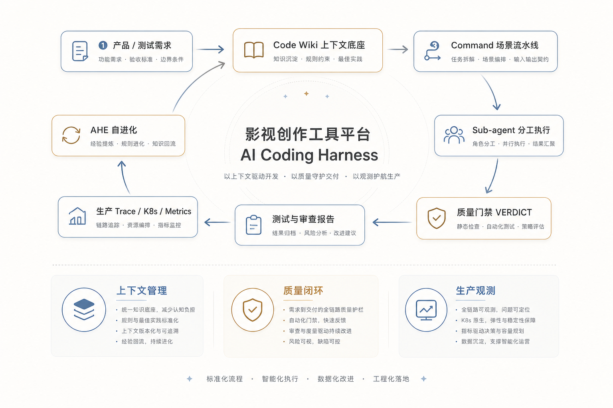

## 一、为什么影视创作工具平台既适合 AI Coding，也容易把 AI Coding 用坏

这类平台的服务端通常不是单一 CRUD。一个“生成内容并查询结果”的需求，背后可能同时涉及：

- HTTP 接口：例如创建任务、查询内容、更新状态；
- Service 编排：参数校验、权限判断、调用外部生成服务；
- DAO 与模型：任务表、章节表、资产表、阶段表；
- Schema：请求参数、响应结构、分页结构；
- Kafka Consumer：外部算法完成后回写结果；
- 异步任务：转码、审核、导出、补偿；
- 观测链路：`request_id`、日志、指标、错误码。

在我们的服务端实践中，一个典型链路可以抽象成这样：

```text
app/routers/...        # HTTP 入口，负责参数、权限、响应包装
  -> app/services/...  # 业务编排，负责调用 DAO、Gateway、Task
  -> app/dao/...       # 数据访问，只做持久化读写
  -> app/models/...    # ORM 模型，承载表结构和默认值
  -> app/schemas/...   # 请求/响应 DTO
  -> app/gateways/...  # 外部生成、资产、审核等服务
  -> app/services/kafka/... # 消息回调与状态更新
```

AI 如果只看到一个 Router，很容易直接在 Router 里拼数据库逻辑；如果只看到一个 Model，很容易漏掉 Schema、DAO、测试和 Kafka 回写；如果只看一个失败日志，又可能给出“看起来合理但无法验证”的修复建议。

早期直接用 AI 对话写代码时，最常见的问题不是“写不出来”，而是：

- 上下文靠人工粘贴，漏掉哪个文件完全看运气；
- 规范靠口头提醒，同一个约束每次都要重新说；
- 测试靠事后补，失败后再让 AI 回头修；
- 任务一长，模型容易遗忘前面已经确认过的兼容性和风险；
- 多人协同时，提示词和经验沉淀在个人习惯里，很难共享。

这也是我们从“Prompt Engineering”转向“Harness Engineering”的原因：把 AI Coding 纳入可重复、可审计、可持续改进的工程流程。

## 二、把 Harness 嵌入日常研发工作流

我们没有把 Harness 设计成一个独立平台，而是把它放进研发同学每天实际会用的命令式工作流里。

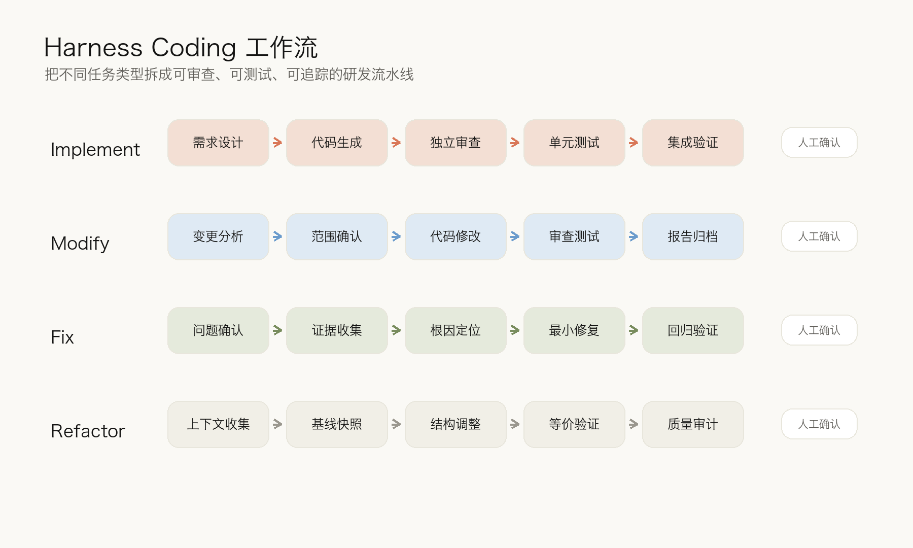

核心思想是：不同类型任务走不同流水线，流水线内部用专职 Agent 协作，关键阶段保留人类确认卡点。

### 1. Implement：新需求从 0 到 1

适用于全新接口、全新业务能力、完整功能模块。

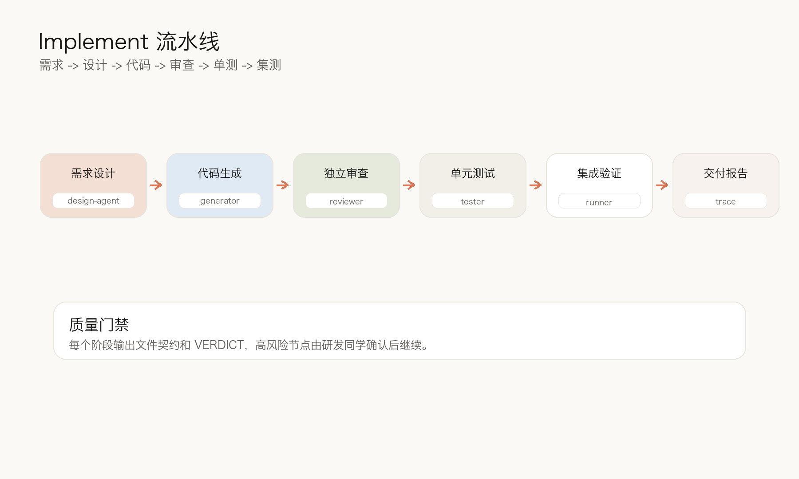

| 步骤 | 阶段 | 主要 Agent / Skill | 产出 |
|---|---|---|---|
| 1 | 需求设计 | `requirement-design-agent` | `task_card.json`，包括接口、DB、兼容性、风险 |
| 2 | 代码生成 | `generator-agent` | 改动文件列表与实现代码 |
| 3 | 独立审查 | `code-reviewer-agent`、`security-reviewer-agent` | `review_feedback.md` 与 `VERDICT` |
| 4 | 单元测试 | `unit-test-gen-agent`、`test-runner-agent` | 测试文件、测试数据、执行结果 |
| 5 | 失败修复 | `debugger-agent` | 最小化修复，不扩大重构范围 |
| 6 | 报告归档 | `ahe-observer` | 阶段结果、重试次数、最终摘要 |

需求设计阶段是第一道硬卡点。Agent 会先把涉及接口、影响文件、数据库变更、兼容策略、风险等级列出来，研发同学确认后才进入代码生成。

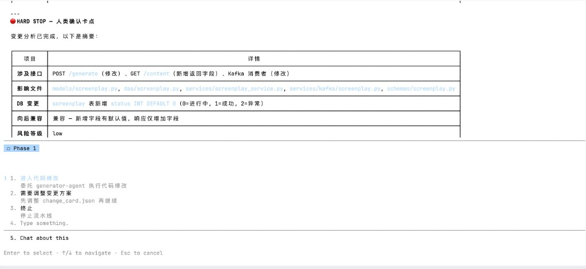

这个卡点看似降低了自动化程度，实际是在把返工成本最高的地方提前暴露。对于状态字段、异步任务、回调消费这类变更，如果一开始没有讲清楚默认值、旧数据兼容和查询语义，后面生成再快也很容易偏。

### 2. Modify：已有能力的行为变更

适用于已有接口的字段变更、校验规则调整、响应格式调整、业务规则修改。

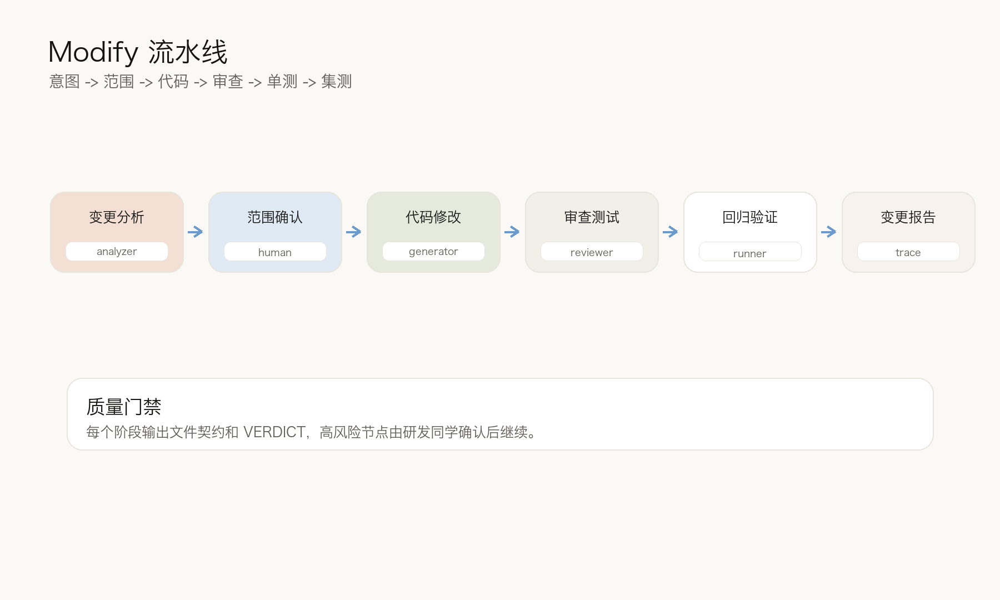

| 步骤 | 阶段 | 主要 Agent / Skill | 关注点 |
|---|---|---|---|
| 1 | 变更分析 | 命令自身轻量分析 | 现状、目标行为、影响接口、兼容性 |
| 2 | 范围确认 | 人类确认 | 是否只改本次范围，是否需要 DB 变更 |
| 3 | 代码修改 | `generator-agent` | 在既有实现上做最小变更 |
| 4 | 审查与测试 | Reviewer + Tester | 防止改漏调用方、测试漏旧行为 |
| 5 | 报告 | `ahe-observer` | 本次变更摘要与结果沉淀 |

这条流水线的关键不是“写新代码”，而是先把已有行为说清楚。比如一个状态字段新增，可能会影响创建接口、内容查询、Kafka 消费和前端轮询语义。Harness 会把这些影响范围放入 `change_card.json`，后续 Agent 都围绕这份文件契约工作。

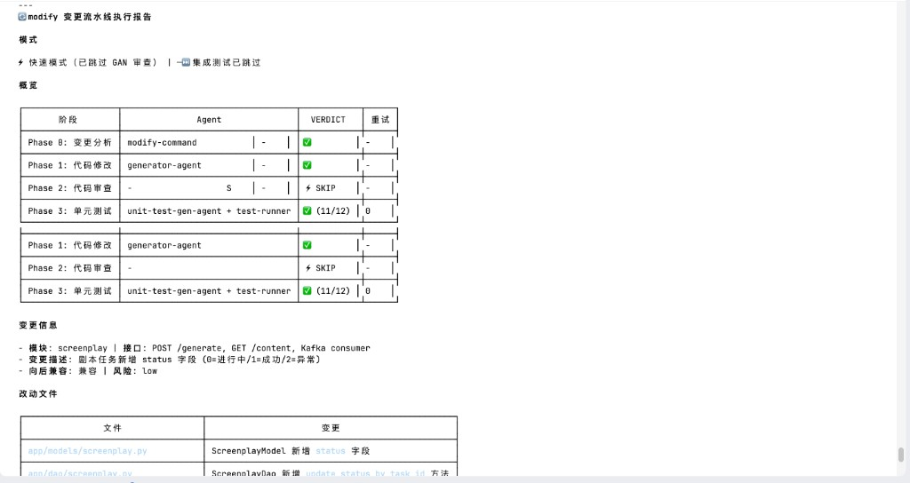

### 3. Fix：从问题到最小修复

适用于测试失败、审查 Critical、线上异常、手动报告的 Bug。

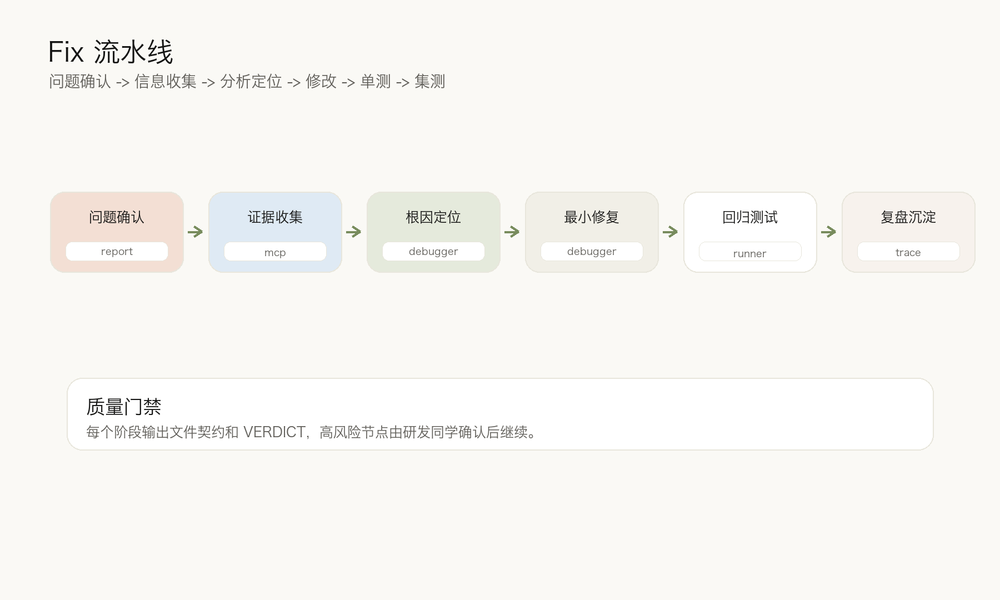

| 步骤 | 阶段 | 主要 Agent / Skill | 产出 |
|---|---|---|---|
| 1 | 问题确认 | 命令自身 / 人类补充 | `bug_report.md` |
| 2 | 证据收集 | `debugger-agent` + 只读 MCP | 日志、指标、事件、测试失败信息 |
| 3 | 根因定位 | `debugger-agent` | `diagnosis.md` |
| 4 | 最小修复 | `debugger-agent` | 修复代码与改动文件 |
| 5 | 修复审查 | Reviewer | 是否引入新风险 |
| 6 | 回归验证 | Tester | 回归用例与执行结果 |

Fix 流水线尤其强调“先证据，后修改”。线上异常不能只靠猜测，至少要把 `trace_id`、错误栈、Pod 状态、相关指标和代码路径串起来，才能进入修复。

### 4. Refactor：行为不变的结构优化

适用于跨层引用、重复逻辑、大函数、命名混乱、技术债清理。

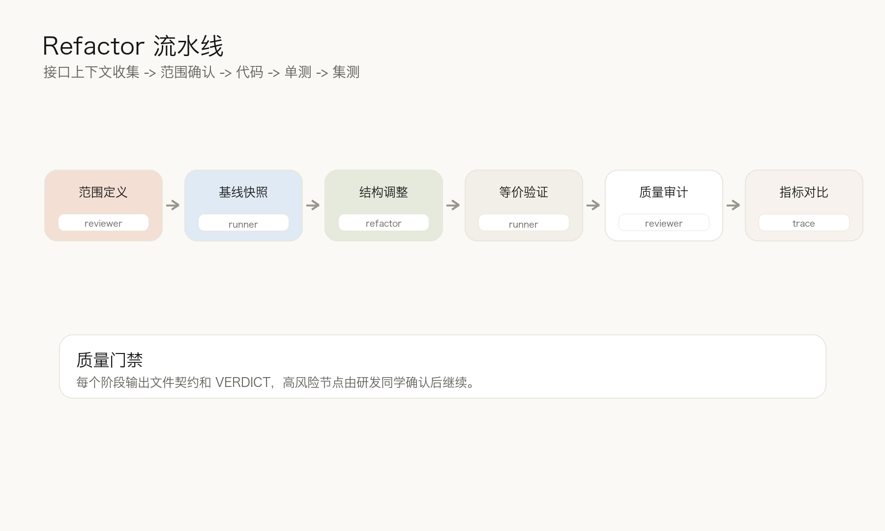

| 步骤 | 阶段 | 主要 Agent / Skill | 约束 |
|---|---|---|---|
| 1 | 上下文收集 | `code-reviewer-agent` | 确认重构范围 |
| 2 | 基线快照 | `test-runner-agent` | 记录重构前测试与指标 |
| 3 | 批量重构 | 命令自身 / Generator | 按范围做结构调整 |
| 4 | 行为等价验证 | `test-runner-agent`、`debugger-agent` | 测试在审查之前 |
| 5 | 质量审计 | Reviewer | 结构是否真的变好 |
| 6 | 指标对比 | 命令自身 | 复杂度、跨层引用、重复代码变化 |

Refactor 和 Implement 最大的区别是：行为不变是硬约束。所以这条流水线会把测试和基线放在审查之前，先证明没有改变外部行为，再讨论结构是否更清晰。

## 三、如何保证高质量生成代码

真正影响生成质量的，不只是模型能力，而是模型在每个阶段拿到什么上下文、受到什么约束、由谁来验证。

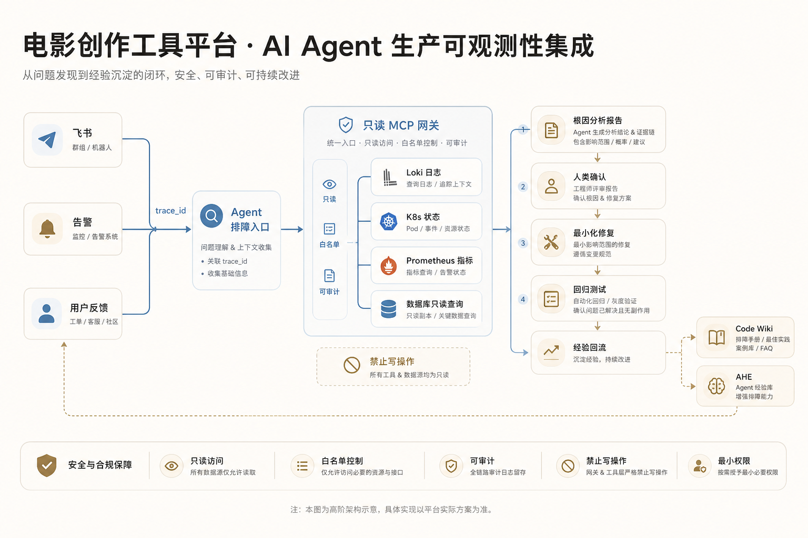

### 3.1 Code Wiki：给 Agent 用的工程地图

Code Wiki 不是传统意义上“给人看的项目文档”，而是给 Agent 消费的结构化上下文。

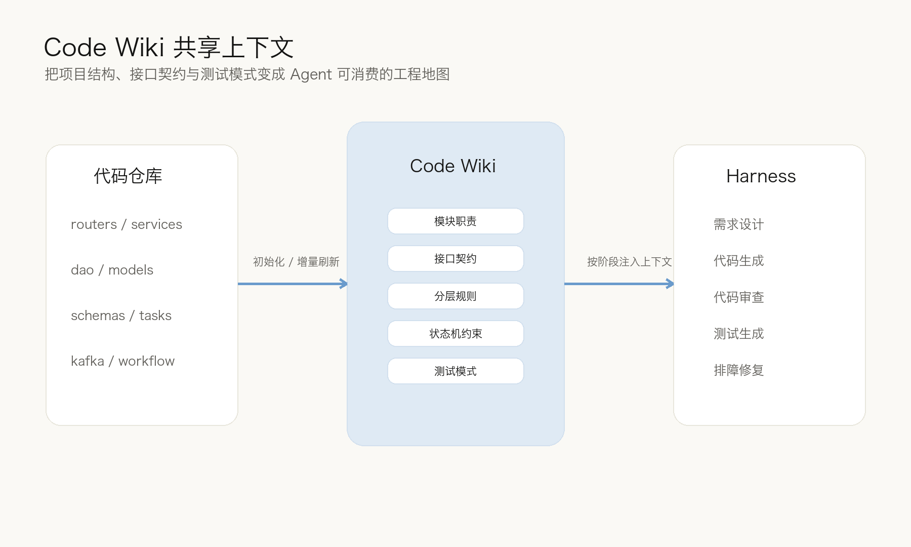

它通常包含几类知识：

| Wiki 内容 | Agent 使用方式 |
|---|---|
| 模块职责 | 判断代码应该落在哪一层、哪个文件 |
| 接口契约 | 确认响应结构、错误码、分页格式 |
| 分层规则 | 阻止 Router 直连 DAO、Service 自建 Session 等违规 |
| 状态机约束 | 明确任务状态、默认值、旧数据兼容 |
| 测试模式 | 复用本项目已有测试目录、fixture、数据构造方法 |

在我们的实践里，Code Wiki 会把服务端的稳定模式沉淀下来，例如：

- Router 只做参数、权限和响应包装；
- Service 负责编排 DAO、Gateway、Task；
- DAO 不承载业务判断，只做数据访问；
- 业务异常走统一错误码和响应结构；
- 新增任务状态必须说明默认值、旧数据兼容和查询语义；
- Kafka 消费要考虑幂等、超时、手动提交和失败状态回写；
- 测试按 Router 或领域目录组织，避免随意新建测试位置。

更重要的是，Wiki 要保持鲜活度。Harness 在 Pre-flight 阶段会检查 `.wiki/MANIFEST.json` 的 stale 标记。如果某些章节对应的源文件已经变化，它会提示研发同学先刷新上下文，或者明确带着过期风险继续执行。

这一步很关键。AI Coding 的上下文不是越多越好，而是要足够稳定、足够贴近团队真实工程约束。

### 3.2 Extensions：把项目规则注入专职 Agent

我们没有把所有规则写进一个超级 Prompt，而是把规则拆成可挂载的 Extensions。

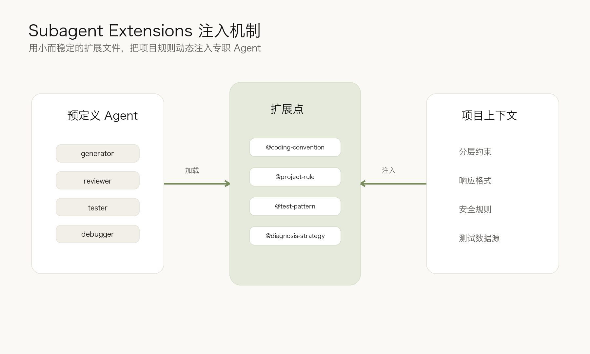

每个 Agent 有自己的扩展点。例如：

| Agent | 扩展点 | 例子 |
|---|---|---|
| `generator-agent` | `@coding-convention` | 生成代码前读取分层规范和接口规范 |
| `code-reviewer-agent` | `@project-rule` | 审查时把跨层调用标为 Critical |
| `security-reviewer-agent` | `@security-rule` | 检查凭据、配置、权限、注入风险 |
| `unit-test-gen-agent` | `@test-pattern` | 按项目既有测试风格生成用例 |
| `debugger-agent` | `@diagnosis-strategy` | 针对日志、DB、消息队列扩展诊断策略 |

一个脱敏后的扩展文件可以抽象成这样：

```yaml
---
extension-point: coding-convention
priority: 10
description: 从 Code Wiki 加载项目编码规范
---

生成代码时读取以下上下文：
- 分层架构约定：Router -> Service -> DAO -> Model
- 统一响应格式：业务响应必须走统一 Schema
- 错误处理模式：业务异常必须走统一错误码
- 依赖注入契约：Session 和用户身份由入口层注入
```

这样做的好处是，团队规则不再散落在个人提示词里，而是以文件形式沉淀，并且能按 Agent 职责精确注入。

生成代码时需要的是编码约束；审查代码时需要的是判断标准；测试生成时需要的是测试模式；排障时需要的是诊断策略。把这些上下文拆开，反而比一个大而全的 Prompt 更稳定。

### 3.3 云端环境打通：只读 MCP 进入排障链路

AI 要参与线上排障，不能只看代码。很多问题的证据在日志、指标和集群事件里。

但这里有一个前提：必须先定义安全边界。我们接入生产观测能力时，采用的是只读 MCP，而不是给 Agent 一把通用 `kubectl` 或数据库写权限。

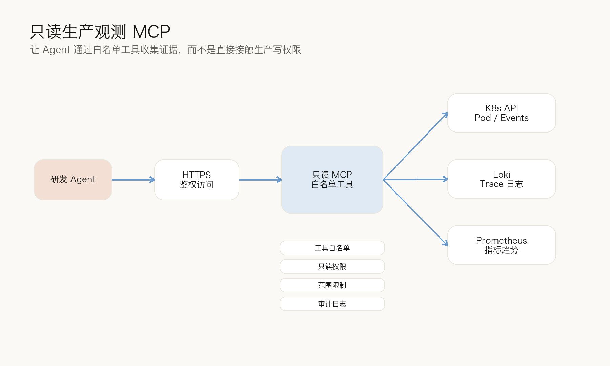

一个脱敏后的架构可以概括为：

```text
研发 Agent
  -> HTTPS + 鉴权凭据
  -> 只读 MCP Server
     -> K8s API：查询 Pod、Deployment、Events、Pod Logs
     -> Loki：按 trace_id / request_id 查询日志
     -> Prometheus：查询 QPS、错误率、P95、CPU、内存
```

这里的设计原则很明确：

- 工具白名单化，不提供任意 shell；
- K8s 只允许 `get/list` 和日志读取，不允许 `exec/delete/apply`；
- namespace、时间窗、日志行数、输出字符数都有限制；
- 所有工具调用写审计日志，但不记录鉴权凭据；
- 组合诊断工具只负责收集证据和输出分析，不直接执行生产修复。

当线上接口异常时，研发同学只需要提供问题描述和 `trace_id`，Debugger Agent 可以按顺序收集：

1. 相关请求日志和异常堆栈；
2. 服务 Pod 状态、Deployment 副本和 K8s Events；
3. 错误率、P95 延迟、CPU、内存趋势；
4. 必要的只读数据比对；
5. 结合代码路径输出根因分析；
6. 经人类确认后进入最小化修复和回归验证。

这让 AI 从“只能看代码的助手”变成“能参与证据收集的排障协作者”，同时不会突破生产安全边界。

## 四、单元测试与审查：把主观判断变成 VERDICT

在 Harness 里，代码生成完成并不代表任务完成。

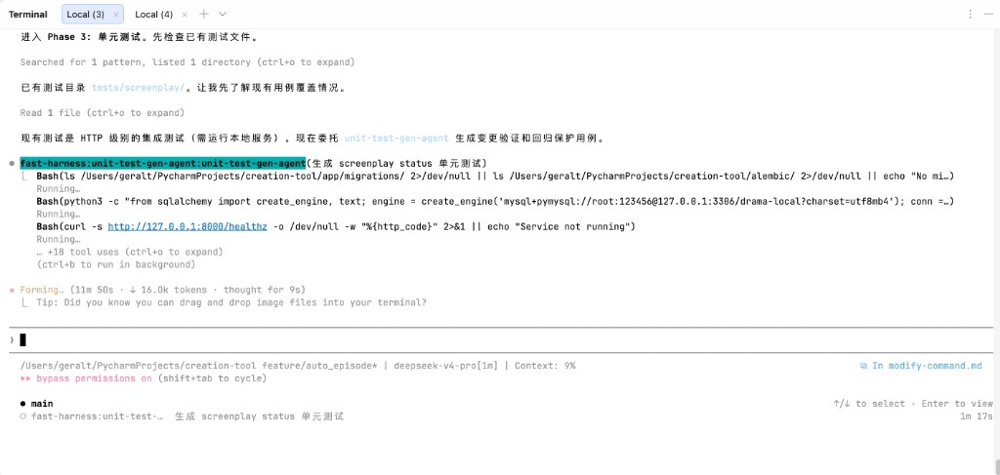

测试 Agent 会优先识别本次变更关联的 Router 或领域目录，再生成覆盖本次行为的用例。对于状态字段类需求，测试通常会覆盖：

- 初始态是否正确；
- 成功态是否正确返回内容；
- 失败态是否抛出业务错误码；
- 处理中状态是否保持可轮询语义；
- 旧数据默认值是否兼容。

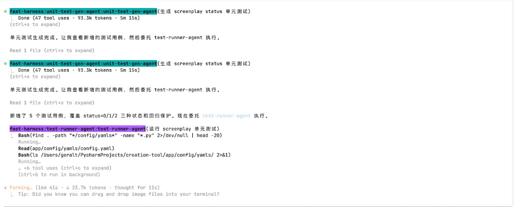

审查也不是一句“看起来没问题”。我们要求 Reviewer 输出明确的 `VERDICT`，并把问题分成 Critical、Improvement、Nitpick。

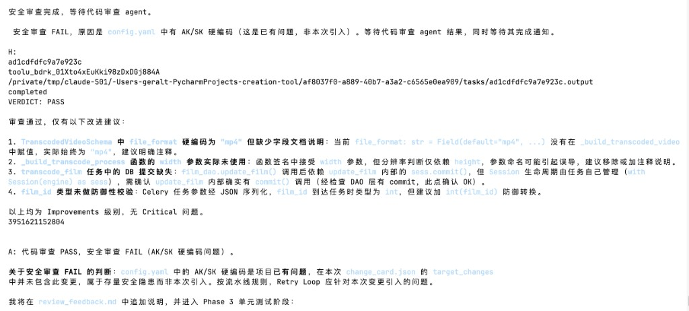

这里有一个容易被忽视的点：安全审查要区分“本次引入的问题”和“存量问题”。如果某个配置文件里本来就存在风险，但本次变更没有触碰它，流水线应该记录风险并提醒治理，而不是把所有存量问题都归咎于当前需求。

这能避免两种极端：一种是安全审查形同虚设；另一种是每次都被存量问题阻断，导致团队绕开流程。

## 五、长期维护：AHE 轨迹自进化

一套 Harness 刚搭起来时，最大的问题不是功能不够，而是不知道哪里最该优化。

是需求设计阶段问得不够细？是 Generator 经常漏掉状态兼容？是 Reviewer 规则太松？是测试 Agent 构造数据不稳定？还是线上排障时缺少某个监控源？

如果这些问题只能靠人工翻聊天记录，很难持续改进。因此我们引入 AHE，也就是 Agentic Harness Engineering。

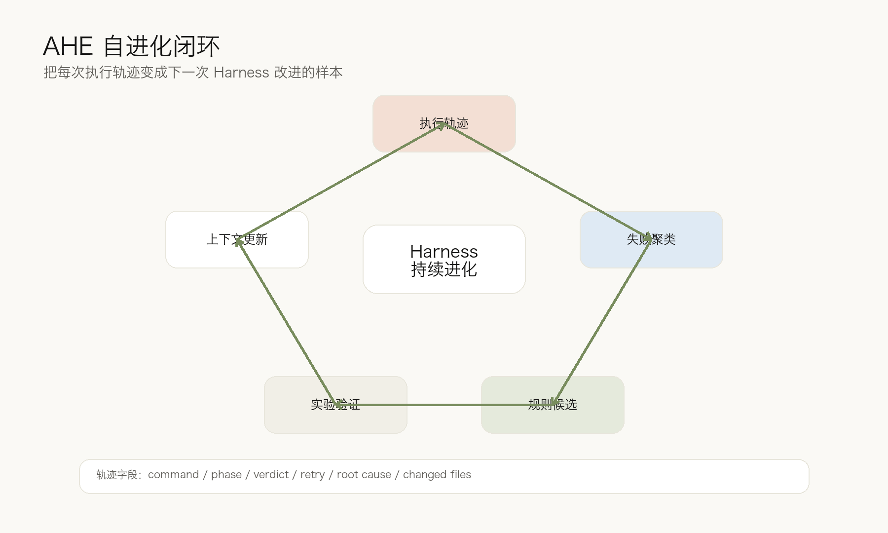

每次命令执行都会生成结构化轨迹，例如：

```json
{
  "trace_id": "脱敏后的执行 ID",
  "command": "modify",
  "module": "业务模块",
  "mode": "full",
  "phases": ["analysis", "generation", "review", "unit_test"],
  "verdicts": ["PASS", "FAIL", "PASS"],
  "retry_count": 1,
  "root_cause": "测试覆盖缺少旧状态兼容场景"
}
```

这些轨迹积累起来后，可以做三件事。

第一，聚类失败模式。比如发现“新增状态字段”类任务经常在测试阶段失败，就说明 Code Wiki 或测试生成策略里需要强化旧数据兼容。

第二，归因到 Harness 组件。失败不是笼统归因于“AI 不稳定”，而是尽量定位到某个阶段、某个 Agent、某条规则、某类上下文缺失。

第三，把改进候选变成实验。比如给生成阶段增加“新增状态字段必须说明默认值和旧数据迁移策略”的规则，再用后续任务验证通过率是否提升。

这也是我们认为 Harness 需要长期维护的原因。它不是一次性配置，也不是某个人的提示词收藏，而是一套会随着团队代码、业务和失败样本持续演化的工程系统。

## 六、实践效果：不只看生成了多少代码

目前我们没有把所有指标做成严格量化报表，所以这里不写夸张数字，只讲观察到的变化和建议统计口径。

### 代码生成质量

接入 Harness 前，AI 生成经常能完成局部代码，但容易出现“位置不对、层级不对、测试缺失、状态兼容漏掉”的问题。接入后，最大的变化不是每次都能一次通过，而是失败更早暴露，修复路径更明确。

建议长期观察这些指标：

| 指标 | 说明 |
|---|---|
| 首次审查 PASS 率 | 生成代码进入 Reviewer 后一次通过的比例 |
| Critical 问题数量 | 跨层调用、错误响应、权限遗漏、敏感信息等阻断项 |
| 测试首次通过率 | 单元测试生成后首次执行通过比例 |
| Retry 次数 | 每个任务平均需要多少轮修复 |

### 架构完整性

最大的收益是减少“野代码”。以前 AI 容易在最方便的位置补逻辑，比如 Router 里直接查库、Service 里拼响应、DAO 里塞业务判断。通过 Code Wiki、Extensions 和 Reviewer 规则，Agent 会更稳定地遵循项目分层。

对于 FastAPI 服务端来说，这一点比少写几行代码更重要。因为一旦分层被破坏，短期看功能能跑，长期会把系统带回难以维护的状态。

### 运维与排障效率

通过只读 MCP 和监控 Agent，研发同学可以更快从 `trace_id` 进入证据链路：日志、指标、K8s 事件、代码路径放在同一个诊断报告里。

这并不意味着 AI 可以自动修生产问题。相反，我们更强调边界：AI 负责收集证据、提出根因和最小修复建议；人类负责确认风险、决定是否上线和如何回滚。

在此基础上，还可以接入定时巡检：接口错误率、K8s 事件、Pod 重启、慢接口、任务堆积等情况由 Monitor Agent 生成摘要，异常时通知值班同学介入。

## 七、几点经验

第一，先管上下文，再管生成。没有项目上下文，模型越强，越容易写出“通用正确但项目错误”的代码。

第二，把质量门禁前移。需求确认、变更范围、DB 兼容、风险等级应该在写代码前明确，而不是代码写完再补救。

第三，Generator 不要自评。写代码和审查代码最好由不同 Agent 完成，审查还要有明确 `VERDICT`。

第四，生产能力必须只读、白名单、可审计。让 AI 接入日志和指标是有价值的，但不能把生产写权限交给通用 Agent。

第五，Harness 要靠轨迹持续进化。每一次失败都应该尽量留下结构化原因，成为下一次规则改进的样本。

## 总结

这次实践给我们的最大启发是：生产级 AI Coding 的核心不是单次 Prompt，也不是某个模型，而是 Harness Engineering。

在影视创作工具平台里，AI 要写好代码，必须先理解上下文；要稳定交付，必须有质量门禁；要参与生产排障，必须有只读、安全、可审计的工具边界；要长期变好，必须记录 Trace 并反向改进规则。

当 Code Wiki 管上下文、Command 管流程、Sub-agent 管职责、MCP 管生产证据、AHE 管持续进化时，AI Coding 才真正从个人提效工具，变成团队研发基础设施。
