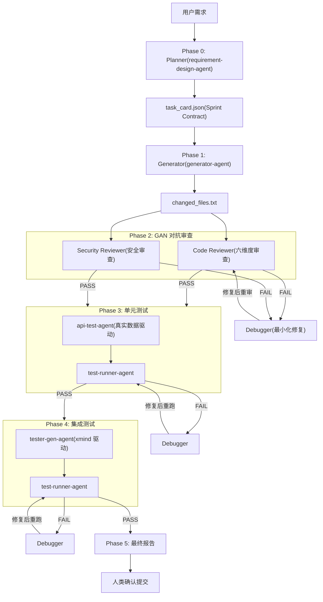

# 生产级项目 AI 编程开发套件使用说明

> 基于 [Anthropic Harness Design](https://www.anthropic.com/engineering/harness-design-long-running-apps) 三体架构，构建 Generator-Evaluator 分离的多 Agent 协作流水线。

---

## 目录

- [1. 为什么需要开发套件](#1-为什么需要开发套件)
- [2. fast-harness 组成](#2-fast-harness-组成)
- [3. 快速启动第一个任务](#3-快速启动第一个任务)
- [4. Token 消耗与成本估算](#4-token-消耗与成本估算)
- [5. 不适用场景](#5-不适用场景)
- [6. 架构全景](#6-架构全景)
- [7. 命令全解](#7-命令全解)
  - [7.1 /implement — 端到端需求实现流水线](#71-implement--端到端需求实现流水线)
  - [7.2 /fix — Bug 修复闭环流水线](#72-fix--bug-修复闭环流水线)
  - [7.3 /refactor — 批量代码重构流水线](#73-refactor--批量代码重构流水线)
- [8. 实战场景](#8-实战场景)

---

## 1. 为什么需要开发套件

在生产级项目中使用 AI 编程，裸对话模式会遇到一系列结构性问题。本套件针对每个痛点提供系统性解决方案：

| 痛点 | 裸对话模式的问题 | 套件解决方案 |
|------|-----------------|-------------|
| **重复的提示词和模板** | 每次启动任务都要手写相似的 Prompt，格式不统一，质量依赖个人经验 | `/implement` Command 一键启动标准化流水线，内置完整 Prompt 模板 |
| **人工复制大量辅助信息丢给 AI** | 需要手动粘贴代码片段、数据库结构、API 文档等上下文，费时且容易遗漏 | `task_card.json` 文件契约自动传递上下文，Agent 间通过结构化 JSON 通信，不依赖对话历史 |
| **AI 缺失关键信息时不会主动询问** | AI 倾向于"猜测"缺失信息而非停下来问，导致实现偏离需求 | 每个 Agent 内置 `AskQuestion` 强制卡点，遇到歧义**必须停下询问**，禁止猜测 |
| **长流程复杂问题占用大量上下文** | 单对话处理需求→设计→编码→测试，超过 40 轮工具调用后一致性显著下降 | **Context Reset** 机制 — 每个 Sub-agent 从文件契约获取上下文，独立执行后返回 VERDICT，主流程不膨胀 |
| **缺乏有效的代码规定约束机制** | AI 生成代码后自我评估失灵，"看起来对"但实际有隐患 | **GAN 对抗审查** — Generator 不自评，由独立的 Code Reviewer（六维度）+ Security Reviewer 并行鉴别 |
| **长期 AI 编程导致架构偏移** | 持续迭代中逐渐打破分层架构约定，跨层引用、职责混乱 | 架构合规性自动检测 — Reviewer 使用 `rg` 命令扫描跨层引用，违反层级依赖规则直接标记 Critical |
| **从需求到交付容易遗漏功能点** | 需求文档→代码→测试之间缺少结构化追踪，容易漏实现、漏测试 | 端到端流水线 Phase 0→5 全覆盖，task_card.json 贯穿全程，每个 API 都有对应的测试用例 |

### 核心设计理念

借鉴 GAN（生成对抗网络）的思想 — **将生成者与评判者分离**：

- **Generator**（代码生成 Agent）只负责写代码
- **Evaluator**（审查/测试 Agent）独立评判代码质量
- 两者通过 **VERDICT 协议**（二元信号 PASS/FAIL）通信
- 避免了单 Agent 的两个根本缺陷：**上下文窗口侵蚀**和**自我评估失灵**

---

## 2. fast-harness 组成

### 目录结构

```
fast-harness/
├── .claude-plugin/
│   └── plugin.json              # 插件元数据
├── commands/
│   ├── implement-command.md     # 端到端需求实现流水线
│   ├── fix-command.md           # Bug 修复闭环流水线
│   └── refactor-command.md     # 批量代码重构流水线
├── agents/
│   ├── requirement-design-agent.md   # Planner — 需求设计
│   ├── generator-agent.md            # Generator — 代码生成
│   ├── code-reviewer-agent.md        # Code Reviewer — 代码审查
│   ├── security-reviewer-agent.md    # Security Reviewer — 安全审查
│   ├── api-test-agent.md             # 单元测试生成（真实数据驱动）
│   ├── tester-gen-agent.md           # 集成测试生成（xmind 脑图驱动）
│   ├── test-runner-agent.md          # Executor — 测试执行
│   ├── debugger-agent.md             # Debugger — 调试修复（双路径）
│   └── monitor-agent.md              # Monitor — K8s 监控
└── skills/
    ├── dev-mysql-bastion-query/      # 堡垒机 SSH 隧道查 MySQL
    ├── kubectl-readonly/             # K8s 只读查询
    ├── k8s-monitor-full/             # K8s 监控诊断全套
    ├── loki-log-keyword-search/      # Loki 日志关键词检索
    └── prometheus-metrics-query/     # Prometheus 指标查询
```

### 三大组件分类

#### Commands — 流水线编排

| Command | 说明 |
|---------|------|
| `implement-command` | 端到端需求实现流水线，从需求出发经过设计、生成、GAN 对抗审查、单元测试、集成测试，最终产出可提交代码 |
| `fix-command` | Bug 修复闭环流水线，从 Bug 报告出发经过诊断修复、GAN 对抗审查、回归测试，最终产出通过全部测试的修复代码 |
| `refactor-command` | 批量代码重构流水线，从重构目标出发经过基线快照、批量重构、行为等价验证、质量审计，产出结构改善且行为不变的代码 |

#### Agents — 9 个专职 Agent

| Agent | 角色 | 模型 | 写权限 | 核心职责 | 产出 |
|-------|------|------|--------|----------|------|
| **requirement-design-agent** | Planner | opus | 是 | 将模糊需求转化为结构化 JSON 任务卡 | `task_card.json` + 详细设计文档 |
| **generator-agent** | Generator | sonnet | 是 | 按任务卡编写实现代码 | 实现代码 + `changed_files.txt` |
| **code-reviewer-agent** | Code Reviewer | opus | 否 | 六维度代码质量审查 | VERDICT: PASS/FAIL |
| **security-reviewer-agent** | Security Reviewer | opus | 否 | 安全漏洞审查（与 Code Reviewer 并行） | VERDICT: PASS/FAIL |
| **api-test-agent** | 单元测试 | opus | 是 | 连接本地 DB 查真实数据，生成 pytest 用例 | `{module}_unit_test.py` + `_unit_data.yaml` |
| **tester-gen-agent** | 集成测试 | sonnet | 是 | 解析 xmind 脑图生成 pytest 用例 | `{module}_api_test.py` + `_test_data.yaml` |
| **test-runner-agent** | Executor | sonnet | 否 | 运行测试用例，报告结果 | VERDICT + 结果报告 |
| **debugger-agent** | Debugger | sonnet | 是 | 双路径：本地 FAIL 修复 / 线上问题排查 | 修复代码 + 排查报告 |
| **monitor-agent** | Monitor | - | 否 | K8s + Prometheus 监控查询 | 结构化状态报告 |

> **模型差异化原则**：审查类 Agent（Reviewer）使用 opus 深度推理确保质量；生成类 Agent（Generator/Tester/Executor）使用 sonnet 保证吞吐量。

#### Skills — 运维能力底座

| Skill | 用途 | 安全级别 |
|-------|------|----------|
| `dev-mysql-bastion-query` | 经堡垒机 SSH 隧道只读查询开发环境 MySQL | 只读 |
| `kubectl-readonly` | 只读查询 K8s Pod/Deployment/Events 状态 | RBAC 只读 |
| `k8s-monitor-full` | K8s + Loki + Prometheus 一体化诊断 | 只读 |
| `loki-log-keyword-search` | 根据关键词/request_id 检索 Loki 日志 | 只读 |
| `prometheus-metrics-query` | 查询 ARMS Prometheus 监控指标（QPS/错误率/延迟/CPU/内存） | 只读 |

所有 Skill 均为**只读操作**，通过 RBAC 权限 + 堡垒机隧道双重保障，不会误操作生产数据。

---

## 3. 快速启动第一个任务

### 最简启动

```
/implement 我需要实现一个团队积分查询功能
```

输入这一条命令后，流水线会自动经过以下阶段：

```
Phase 0  需求设计     → Planner Agent 与你多轮确认需求、API 设计、数据库设计
                        [人类确认] ✋ 确认设计方案后继续
Phase 1  代码生成     → Generator Agent 按 task_card.json 编码
Phase 2  GAN 对抗审查 → Code Reviewer + Security Reviewer 并行审查
                        PASS → 继续 | FAIL → 自动修复（最多 3 轮）
Phase 3  单元测试     → api-test-agent 生成 + test-runner 执行
                        PASS → 继续 | FAIL → 自动修复（最多 3 轮）
Phase 4  集成测试     → tester-gen-agent 生成 + test-runner 执行
                        [可选] 需要提供 xmind 测试用例文件
Phase 5  最终报告     → 汇总全部结果
                        [人类确认] ✋ 确认后准备 commit
```

### 带参数启动

```bash
# 指定 sprint 和 module
/implement 我需要实现素材转移功能 sprint=sprint_2026_04 module=asset_transfer

# 附带 xmind 测试用例（启用集成测试）
/implement 我需要实现素材转移功能 xmind=/path/to/asset_transfer.xmind

# 从已有 task_card 继续（跳过需求设计阶段）
/implement task_card=/tmp/task_card.json

# ⚡ 快速模式（跳过 GAN 对抗审查，节省 Token）
/implement 我需要实现素材转移功能 fast=true
```

### 你需要做什么

流水线会在以下节点暂停等待你确认：

| 卡点 | 位置 | 你需要做什么 |
|------|------|-------------|
| 需求确认 | Phase 0 每个 Step 结尾 | 确认需求理解、技术方案、数据库设计、API 设计是否准确 |
| 设计完成 | Phase 0 结束 | 确认 task_card.json 是否正确，是否进入编码阶段 |
| GAN 超限 | Phase 2 重试 3 轮仍 FAIL | 选择：人工修复 / 忽略继续 / 终止流水线 |
| 测试超限 | Phase 3/4 重试 3 轮仍 FAIL | 选择：人工修复 / 跳过 / 终止 |
| 最终确认 | Phase 5 | 确认提交，获得建议的 git commit message |

---

## 4. Token 消耗与成本估算

### 各流水线典型消耗

| 流水线 | 典型 Token 消耗 | 典型耗时 | 主要消耗环节 |
|--------|----------------|----------|-------------|
| `/implement`（完整 Phase 0-5） | 300k – 500k | 15 – 30 min | Phase 0 多轮 AskQuestion 确认 + Phase 2 GAN 循环 |
| `/implement`（跳过 Phase 0，从 task_card 继续） | 150k – 300k | 8 – 15 min | Phase 1 编码 + Phase 2 GAN 循环 |
| `/implement fast=true`（快速模式） | 100k – 200k | 6 – 12 min | 跳过 GAN 审查，仅编码 + 测试 |
| `/fix` | 100k – 200k | 5 – 15 min | Phase 1 诊断（线上场景含 Loki 查询）+ Phase 3 回归 |
| `/fix from=implement` | 80k – 150k | 5 – 10 min | 跳过问题收集，直接诊断修复 |
| `/fix fast=true`（快速模式） | 50k – 100k | 3 – 8 min | 跳过修复审查，仅诊断 + 回归 |
| `/refactor` | 200k – 400k | 10 – 20 min | Phase 0 诊断扫描 + Phase 2 批量执行 + Phase 3 全量回归 |
| `/refactor fast=true`（快速模式） | 150k – 300k | 8 – 15 min | 跳过质量审计，仅重构 + 行为验证 |

### 消耗放大因子

| 因子 | 影响 | 估算 |
|------|------|------|
| GAN 循环重试 | 每增加 1 轮 GAN 循环，约增加 50k – 80k Token | 3 轮 FAIL ≈ 额外 150k – 240k |
| 测试修复循环 | 每增加 1 轮测试修复，约增加 30k – 50k Token | 主要消耗在 debugger + test-runner |
| Phase 0 多轮确认 | 需求越复杂，AskQuestion 轮次越多 | 简单需求 3-4 轮 ≈ 40k；复杂需求 8 轮 ≈ 100k |
| Sub-agent 并行 | Planner 启动 2 个并行扫描 Agent | 额外 20k – 40k |

### 降低消耗的建议

1. **准备充分的需求文档**：清晰的 PRD/飞书文档可减少 Phase 0 的确认轮次
2. **从 task_card 继续**：已有设计文档时用 `/implement task_card=...` 跳过 Phase 0
3. **使用快速模式**：`fast=true` 跳过 GAN 对抗审查/质量审计，节省 30%-40% Token。适合原型验证、低风险改动、明确根因的修复
4. **小范围改动不走流水线**：单行修复、配置变更等直接编码（见下方"不适用场景"）
5. **指定 scope 缩小范围**：`/refactor scope=app/services/asset_service.py` 比全目录扫描省 Token

---

## 5. 不适用场景

流水线不是万能的，以下场景直接编码更高效：

### 不需要 /implement 的场景

| 场景 | 原因 | 建议操作 |
|------|------|----------|
| 单行 bug 修复 / 纯 typo | 改动极小，流水线 6 个 Phase 的开销远超收益 | 直接改 + 手动 `pytest` 验证 |
| 纯配置变更（YAML / 环境变量） | 无业务逻辑变更，无需 GAN 审查 | 直接改 + 确认配置生效 |
| 只改注释或文档 | 无行为影响，无需测试 | 直接改 |
| 现有接口新增可选返回字段 | 向后兼容的小改动，不涉及架构变更 | 直接改 + 补充单元测试 |
| 复制粘贴式的接口克隆 | 流水线设计面向"理解需求 → 设计 → 实现"，简单复制无需设计 | 直接编码 |

### 不需要 /fix 的场景

| 场景 | 原因 | 建议操作 |
|------|------|----------|
| 需求理解有误导致的"Bug" | 本质是需求变更，修复方向会偏离 | 用 `/implement` 重新走需求对齐 |
| 第三方服务故障导致的报错 | 根因不在本项目代码中 | 排查第三方服务，必要时加降级策略 |
| 环境配置问题（数据库连接/权限） | 非代码层面问题 | 检查部署配置和环境变量 |

### 不需要 /refactor 的场景

| 场景 | 原因 | 建议操作 |
|------|------|----------|
| 涉及接口签名变更的"重构" | 本质是 breaking change，行为不变的硬约束会被打破 | 用 `/implement` 作为新功能实现 |
| 跨多个模块的大规模重写 | 超出单次 refactor 的安全范围 | 拆分为多次小范围 refactor，每次验证后再继续 |
| 数据库表结构迁移 | 涉及 DDL 和数据迁移脚本，超出 refactor 能力 | 独立编写迁移方案 |

### 判断标准速查

```
改动文件 ≤ 2 个 && 无新增 API && 无数据库变更 → 直接编码
改动文件 > 3 个 || 新增 API || 数据库变更 → 考虑使用流水线
涉及跨服务协议变更 → 强烈建议使用 /implement（Phase 0 侵入性检查很关键）
```

---

## 6. 架构全景

### 6.1 流水线整体架构



### 6.2 Agent 间通信：文件契约

Agent 之间不依赖对话历史传递上下文，而是通过**文件契约**实现 Context Reset。所有契约文件统一存放在对应流水线的目录下（如 `.ai/implement/{sprint}_{module}/`）：

| 契约文件 | 写入方 | 读取方 | 用途 |
|----------|--------|--------|------|
| `{contract_dir}/task_card.json` | Planner | 全体 Agent | 需求、API、数据库变更等完整上下文 |
| `{contract_dir}/changed_files.txt` | Generator | Reviewer / Tester | 本次改动的文件列表 |
| `{contract_dir}/review_feedback.md` | Reviewer | Debugger / Generator | 审查反馈（Critical/Improvements） |
| `{contract_dir}/unit_test_results.md` | Test Runner | Debugger | 单元测试执行结果 |
| `{contract_dir}/integration_test_results.md` | Test Runner | Debugger | 集成测试执行结果 |
| `tests/{sprint}/` | api-test / tester-gen | Test Runner | 持久化测试用例（可复用） |

> `{contract_dir}` 按流水线类型分：implement → `.ai/implement/{sprint}_{module}/`，fix → `.ai/fix/{fix_id}/`，refactor → `.ai/refactor/{refactor_id}/`

### 6.3 task_card.json（Sprint Contract）

Planner 输出的结构化任务卡，是后续所有 Agent 的**唯一上下文来源**：

```json
{
  "sprint": "sprint_2026_04",
  "module": "asset_transfer",
  "feature": "素材转移功能",
  "background": "支持将素材从一个项目转移到另一个项目",
  "apis": [
    {
      "method": "POST",
      "path": "/drama-api/assets/transfer",
      "auth": "Bearer Token",
      "request": { "asset_ids": ["int"], "target_project_id": "int" },
      "response": { "code": 0, "data": { "transferred_count": "int" } }
    }
  ],
  "db_changes": ["asset 表新增 transfer_status 字段"],
  "affected_files": [
    "app/routers/asset_router.py",
    "app/services/asset_transfer_service.py",
    "app/schemas/asset_transfer.py"
  ],
  "test_cases": "xmind/sprint_2026_04/asset_transfer.xmind",
  "design_doc": ".ai/design/sprint_2026_04_asset_transfer.md",
  "impact_report": {
    "affected_modules": ["asset_service"],
    "regression_risk": "medium",
    "regression_scope": ["asset_router 现有接口"]
  },
  "status": "inbox"
}
```

**状态流转**：`inbox` → `in_progress` → `review` → `done`

### 6.4 VERDICT 协议

所有 Reviewer 和 Executor 输出必须以二元信号结尾，将主观判断转为可程序化处理的信号：

```
VERDICT: PASS   ← 流水线继续
VERDICT: FAIL   ← 流水线阻断，进入修复循环
```

VERDICT 是质量门控的唯一依据，避免 Reviewer 输出模糊的"建议改进"导致主 Agent 无法判断是否继续。

### 6.5 GAN 对抗循环

本插件的核心质量机制借鉴了 **GAN（Generative Adversarial Network，生成对抗网络）** 的思想：

> GAN 由两个神经网络对抗训练——**Generator（生成器）** 负责生成内容，**Discriminator（判别器）** 负责判断内容质量。两者持续博弈，Generator 在 Discriminator 的反馈压力下不断提升输出质量。

在 AI 编程场景中，单一 Agent 生成代码后缺乏有效的质量反馈回路，容易产出"看起来对但实际有缺陷"的代码。CI/CD 流水线（如 GitHub Actions、Harness）通过 **Pipeline + Stage + Gate** 模式解决了传统软件的质量控制问题——每个 Stage 是一个质量关卡，Gate 不通过则整条流水线阻断。

本插件将这一理念迁移到 AI Agent 协作中：
- **Generator** = `generator-agent`（代码生成）
- **Discriminator** = 多层级质量关卡（审查 → 单元测试 → 集成测试）
- **VERDICT 协议** = Pipeline Gate（PASS 放行 / FAIL 阻断）
- **debugger-agent 修复循环** = 对抗训练的迭代过程

与 Harness Pipeline 的对应关系：

| Harness 概念 | 本插件对应 | 作用 |
|---|---|---|
| Pipeline | implement / fix / refactor 命令 | 端到端流水线 |
| Stage | Round 1/2/3（审查/单元测试/集成测试） | 质量关卡 |
| Approval Gate | VERDICT: PASS / FAIL | 二元门控信号 |
| Rollback on Failure | debugger-agent retry ≤ N | 失败自动修复 |
| Artifact Passing | changed_files.txt / review_feedback.md | Agent 间文件契约 |

每一层 Discriminator 都是独立的质量关卡，层层递进：


### 6.6 测试分类

| 类型 | 别名 | 生成方式 | Agent | 产出 |
|------|------|----------|-------|------|
| 自发性测试 | 单元测试 | 根据接口变动自动查询本地 DB 真实数据生成 | `api-test-agent` | `tests/{sprint}/{module}_unit_test.py` |
| 外部测试 | 集成测试 | 解析测试人员提供的 xmind 脑图生成 | `tester-gen-agent` | `tests/{sprint}/{module}_api_test.py` |

---

## 7. 命令全解

### 7.1 /implement — 端到端需求实现流水线

#### 命令格式

```bash
# 方式一：直接描述需求（触发 Phase 0 需求设计）
/implement <需求描述> [sprint=sprint_name] [module=module_name] [xmind=/path/to/xxx.xmind] [fast=true]

# 方式二：从已有 task_card 继续（跳过 Phase 0）
/implement task_card=/tmp/task_card.json [xmind=/path/to/xxx.xmind] [fast=true]
```

#### 参数说明

| 参数 | 必填 | 说明 |
|------|------|------|
| 需求描述 | 是（与 task_card 二选一） | 自然语言需求，触发完整流水线 |
| `task_card` | 否 | 已有 task_card.json 路径，跳过需求设计阶段 |
| `sprint` | 否 | Sprint 名称，默认按日期生成如 `sprint_2026_04` |
| `module` | 否 | 模块名，用于测试文件命名 |
| `xmind` | 否 | xmind 测试用例路径，用于 Phase 4 集成测试 |
| `fast` | 否 | 设为 `true` 跳过 Phase 2 GAN 对抗审查，节省约 30%-40% Token |

#### Phase 详解

##### Phase 0: 需求设计（Planner）

**Agent**: `requirement-design-agent`

Planner 是流水线的入口，通过 8 个步骤将模糊需求转化为结构化任务卡：

| Step | 内容 | 卡点 |
|------|------|------|
| Step 1 | 需求理解与多模态对齐（文字/飞书文档/截图/PRD） | AskQuestion 确认 |
| Step 2 | 技术方案与初步设计（代码位置/技术选型） | AskQuestion 确认 |
| Step 3 | 数据库/数据结构设计（表结构、字段、索引） | AskQuestion 确认 |
| Step 4 | API 接口与通信规约设计（Request/Response 契约） | AskQuestion 确认 |
| Step 5 | 复杂逻辑与调用链路确认（Mermaid 时序图） | AskQuestion 确认 |
| Step 6 | 编码前侵入性检查（影响范围/回归风险） | AskQuestion 确认 |
| Step 7 | 序列化输出 task_card.json | 自动 |
| Step 8 | 整合输出详细设计文档 | 自动 |

**关键机制**：
- 每个 Step 结尾都有 AskQuestion 门控，用户不确认则不进入下一步
- 歧义处理：识别到不确定内容时**必须停下询问**，禁止猜测
- 复杂需求启用 Sub-agent 并行分析：Agent-A 扫描项目 API，Agent-B 扫描依赖调用链

**产出**：
- `/tmp/task_card.json` — Sprint Contract
- `.ai/design/{sprint}_{feature}.md` — 详细设计文档

##### Phase 1: 代码生成（Generator）

**Agent**: `generator-agent`

按 task_card.json 编写实现代码，遵循增量开发原则：

- 读取 task_card.json 理解 API 列表、数据库变更、受影响文件
- 按项目分层结构实现代码（routers → services → schemas → dao）
- 生成改动文件列表写入 `/tmp/changed_files.txt`
- 更新 task_card.json 状态为 `in_progress`

**约束**：不修改任务卡未列出的文件、不引入未声明的依赖、不写测试代码。

##### Phase 2: GAN 对抗审查

> ⚡ `fast=true` 时跳过整个 Phase 2，直接进入 Phase 3 单元测试。

**Agent**: `code-reviewer-agent` + `security-reviewer-agent`（并行启动）

两个独立 Reviewer 作为"鉴别者"并行评判代码质量：

**Code Reviewer 六维度**：

| 维度 | 审查内容 | 工具 |
|------|----------|------|
| 架构合规性 | 层级依赖规则（禁止跨层引用） | `rg` 扫描 import |
| 圈复杂度 | 函数分支路径数 ≥10 必须拆分 | `radon cc` |
| 重复代码 | 超过 5 行完全相同的业务逻辑块 | `pylint --enable=duplicate-code` |
| 测试覆盖缺口 | 核心 API 是否有 Happy Path 测试 | 扫描 tests/ |
| 代码正确性 | 空值防御、异常处理、事务完整性 | `rg` 模式匹配 |
| Harness 编程实践 | 依赖注入、纯函数隔离、配置外置、日志规范 | `rg` 模式匹配 |

**Security Reviewer 五维度**：SQL 注入、鉴权绕过、敏感信息泄露、命令注入、依赖安全

**VERDICT 汇总**：
- 两者都 PASS → 进入 Phase 3
- 任一 FAIL → 启动 Debugger 修复 → 重审（最多 3 轮）

##### Phase 3: 单元测试

**Step 3a**: `api-test-agent` 连接本地 MySQL 查询真实数据，生成 pytest 单元测试用例

- 覆盖正常路径（happy path）、边界路径（空值/临界值）、异常路径（非法状态/越权）
- 所有测试参数标注数据来源 SQL
- 输出 `tests/{sprint}/{module}_unit_test.py` + `_unit_data.yaml`

**Step 3b**: `test-runner-agent` 执行单元测试

- PASS → 进入 Phase 4
- FAIL → Debugger 修复 → 重跑（最多 3 轮）

##### Phase 4: 集成测试

**跳过条件**：task_card.json 中 `test_cases` 字段为空或未提供 xmind 文件

**Step 4a**: `tester-gen-agent` 解析 xmind 脑图生成测试用例

- `tc-p1-` 前缀 → P1 核心功能用例
- `tc-p2-` 前缀 → P2 次要功能用例
- `tc-p3-` 前缀 → P3 边界场景用例

**Step 4b**: `test-runner-agent` 执行集成测试

- VERDICT 处理同 Phase 3

##### Phase 5: 最终报告

汇总所有阶段结果，输出执行报告：

```markdown
## implement 流水线执行报告

### 概览
| 阶段 | Agent | VERDICT | 重试次数 |
|------|-------|---------|----------|
| Phase 0: 需求设计 | requirement-design-agent | 完成 | - |
| Phase 1: 代码生成 | generator-agent | 完成 | - |
| Phase 2: 代码审查 | code-reviewer + security-reviewer | PASS | 1 |
| Phase 3: 单元测试 | api-test-agent + test-runner | PASS | 0 |
| Phase 4: 集成测试 | tester-gen-agent + test-runner | PASS | 0 |

### 改动文件
- app/routers/asset_router.py
- app/services/asset_transfer_service.py
- app/schemas/asset_transfer.py

### 测试覆盖
- 单元测试：6 个用例，通过率 100%
- 集成测试：8 个用例，通过率 100%
```

用户确认后，输出建议的 git commit message：

```
feat: 新增素材转移功能

- 涉及文件：asset_router.py, asset_transfer_service.py, asset_transfer.py
- 测试覆盖：单元 6 例 + 集成 8 例
```

### 7.2 /fix — Bug 修复闭环流水线

与 `/implement` 互补：`implement` 是正向构建（从零到一），`fix` 是修复闭环（从一到一）。

#### 命令格式

```bash
# 方式一：直接描述 Bug（触发完整修复流水线）
/fix <Bug 描述> [sprint=sprint_name] [module=module_name] [fast=true]

# 方式二：从 implement 流水线衔接（自动读取失败上下文）
/fix from=implement [sprint=sprint_name] [module=module_name] [fast=true]

# 方式三：从已有 Bug 报告继续
/fix bug_report=.ai/fix/{fix_id}/bug_report.md [fast=true]
```

#### 参数说明

| 参数 | 必填 | 说明 |
|------|------|------|
| Bug 描述 | 是（与 bug_report/from 二选一） | 自然语言 Bug 描述 |
| `from` | 否 | 设为 `implement` 时从 implement 流水线的失败结果衔接 |
| `bug_report` | 否 | 已有 bug_report.md 路径，跳过问题收集阶段 |
| `sprint` | 否 | Sprint 名称，默认按日期生成 |
| `module` | 否 | 模块名，用于定位关联文件 |
| `fast` | 否 | 设为 `true` 跳过 Phase 2 修复审查，节省约 30%-40% Token |

#### Bug 来源分类

| 来源 | 输入形式 | 典型场景 |
|------|----------|----------|
| 测试失败 | test-runner 的 `VERDICT: FAIL` | implement 流水线测试阶段失败 |
| 审查反馈 | reviewer 的 Critical 问题 | implement 流水线审查阶段 Critical |
| 线上异常 | request_id / 环境名 / 错误描述 | 用户反馈线上 500、数据异常 |
| 手动报告 | 自然语言描述 | 开发/测试人员发现的 Bug |

#### Phase 详解

##### Phase 0: 问题收集（Intake）

**执行者**: fix-command 自身

将多种来源的 Bug 信息标准化为统一的 `bug_report.md`，存储在 `.ai/fix/{fix_id}/` 目录下。自动识别 Bug 类型并关联上下文（测试结果文件、审查反馈、implement 的 task_card 等）。

**产出**: `.ai/fix/{fix_id}/bug_report.md`

##### Phase 1: 诊断与修复（Debugger）

**Agent**: `debugger-agent`

根据 Bug 来源自动选择执行路径：
- 测试失败 / 审查反馈 / 手动报告 → **路径 A**（本地开发调试）
- 线上异常 → **路径 B**（线上问题排查，需先分析后用户确认才修复）

**产出**: `.ai/fix/{fix_id}/diagnosis.md` + `.ai/fix/{fix_id}/changed_files.txt`

**关键机制**：线上场景下，诊断报告必须经用户确认后才执行代码变更。

##### Phase 2: 修复审查（GAN 对抗）

> ⚡ `fast=true` 时跳过整个 Phase 2，直接进入 Phase 3 回归测试。

**Agent**: `code-reviewer-agent` + `security-reviewer-agent`（并行）

审查重点（与 implement 不同）：
1. 修复是否精准针对根因，未引入无关变更
2. 修复是否可能产生副作用
3. 修复是否遵循最小化原则

**VERDICT 汇总**: 两者都 PASS → 进入 Phase 3 | 任一 FAIL → Debugger 修复后重审（最多 **2 轮**）

##### Phase 3: 回归测试

**Step 3a**: `api-test-agent` 生成回归测试用例

- **修复验证用例**：精准验证原 Bug 已修复
- **回归保护用例**：验证修复未破坏相邻功能
- 追加到已有测试文件，不覆盖原有用例

**Step 3b**: `test-runner-agent` 执行回归测试

- PASS → 进入 Phase 4
- FAIL → Debugger 修复后重跑（最多 **2 轮**）

**Step 3c**（可选）: 若存在已有集成测试，额外执行集成测试回归

##### Phase 4: 修复报告

汇总所有阶段结果，输出修复报告。用户确认后输出建议的 git commit message：

```
fix: {根因一句话描述}

- 修复文件：{affected_files}
- 根因：{root_cause}
- 回归测试：{N} 例通过
```

#### fix 修复闭环流程图
**此处有图**


#### fix vs implement 对比

| 维度 | implement | fix |
|------|-----------|-----|
| **目标** | 从零构建新功能 | 修复已有代码的 Bug |
| **入口** | 需求描述 / task_card | Bug 报告 / 测试失败 / 线上异常 |
| **核心 Agent** | planner → generator → reviewer → tester | debugger → reviewer → tester |
| **GAN 循环上限** | 3 轮 | 2 轮（修复应小范围） |
| **文件契约目录** | `.ai/implement/` | `.ai/fix/` |
| **互操作** | 测试 FAIL 可触发 fix | 可读取 implement 的 task_card |

### 7.3 /refactor — 批量代码重构流水线

与 `/implement` 和 `/fix` 互补：`implement` 新增行为，`fix` 修正行为，`refactor` **改善结构但行为不变**。

> **行为不变是硬约束** — 重构前后所有测试用例必须等价通过。

#### 命令格式

```bash
# 方式一：描述重构目标
/refactor <重构目标描述> [sprint=sprint_name] [module=module_name] [scope=app/services/] [fast=true]

# 方式二：从 implement 审查反馈衔接（提取 Improvements/Nitpicks）
/refactor from=implement [sprint=sprint_name] [module=module_name] [fast=true]

# 方式三：从已有重构计划继续
/refactor plan=.ai/refactor/{refactor_id}/refactor_plan.md [fast=true]
```

#### 参数说明

| 参数 | 必填 | 说明 |
|------|------|------|
| 重构目标描述 | 是（与 from/plan 三选一） | 自然语言描述重构意图 |
| `from` | 否 | 设为 `implement` 时自动提取审查反馈中的改进建议 |
| `plan` | 否 | 已有 refactor_plan.md 路径，跳过范围定义阶段 |
| `sprint` | 否 | Sprint 名称 |
| `module` | 否 | 模块名 |
| `scope` | 否 | 限定重构扫描范围（目录或文件） |
| `fast` | 否 | 设为 `true` 跳过 Phase 4 质量审计，节省约 20%-30% Token。行为等价验证仍执行 |

#### 重构类型

| 类型 | 说明 | 典型操作 |
|------|------|----------|
| `extract` | 提取公共逻辑 | 大函数拆分、重复代码抽取 |
| `rename` | 统一命名规范 | 变量/函数/文件重命名 |
| `move` | 调整代码归属 | 跨模块移动 |
| `simplify` | 降低复杂度 | 消除冗余分支、提前返回 |
| `deduplicate` | 合并重复代码 | 统一相似 DAO/异常处理 |
| `restructure` | 修复架构违规 | 消除跨层引用 |

执行顺序固定为：`restructure` → `move` → `extract` → `deduplicate` → `simplify` → `rename`（先修骨架再动逻辑，最后改命名）。

#### Phase 详解

##### Phase 0: 范围定义（Scope & Plan）

**Agent**: `code-reviewer-agent`（诊断扫描模式）

对目标范围执行圈复杂度、重复代码、架构合规性、命名一致性四维诊断。生成结构化的 `refactor_plan.md`，包含：
- 重构项清单（ID、类型、文件、问题、方案、优先级）
- 不可触碰边界（接口签名、schema 字段、router 路径不得变更）
- 预期改善指标

**关键机制**：人类确认重构范围后才继续。

##### Phase 1: 基线快照（Baseline Capture）

**Agent**: `test-runner-agent`

重构前必须建立两类基线：
1. **测试基线** — 运行所有已有测试，记录每个用例的 PASS/FAIL 状态
2. **质量指标基线** — 圈复杂度（`radon cc`）、跨层引用数、重复代码块数

基线的作用：Phase 3 中精确比对，确保行为等价性。若当前无有效测试基线，流水线会提醒用户风险。

##### Phase 2: 批量重构执行

**执行者**: refactor-command 自身

按固定顺序逐项执行重构。**原子记录**每项改动文件，出问题可精准定位。Git 检查点在 Phase 0 创建，支持一键回退。

**不可触碰红线**：
- 函数外部接口签名（参数名/类型/返回类型）
- Schema 字段定义
- Router 路径和 HTTP 方法
- 已有测试的断言逻辑

##### Phase 3: 行为等价验证

**Agent**: `test-runner-agent` + `debugger-agent`（修复） + `api-test-agent`（补充覆盖）

**核心质量门控** — 与 implement/fix 的关键区别：refactor 中**测试先于审查**。

验证规则（严格）：
- 基线 PASS 的用例 → 重构后必须仍然 PASS
- 基线 FAIL 的用例 → 重构后不得恶化（仍 FAIL 可接受）
- 不得出现新的失败用例

若验证失败 → debugger-agent 修复（最多 2 轮），约束：**只能调整重构实现方式，不得修改测试断言**。超限可选择一键回退到 Git 检查点。

若重构涉及的路径缺少测试覆盖 → api-test-agent 补充回归测试（标记 `@pytest.mark.refactor`）。

##### Phase 4: 质量审计

> ⚡ `fast=true` 时跳过整个 Phase 4，直接进入 Phase 5 重构报告。

**Agent**: `code-reviewer-agent` + `security-reviewer-agent`（并行）

审查重点（与 implement 不同）：
1. 重构是否达成预期改善目标
2. 是否引入不必要的抽象层级
3. 重命名/移动后的 import 是否全部更新
4. 是否存在遗漏的引用更新

**审计 FAIL 不强阻塞**（行为已验证正确），但在报告中显著标注。修复循环上限 **1 轮**。

##### Phase 5: 重构报告

汇总前后指标对比，输出可度量的改善结论：

```markdown
## 改善指标对比
| 指标 | 重构前 | 重构后 | 改善 |
|------|--------|--------|------|
| 圈复杂度 max | D(12) | B(5) | ⬇️ 58% |
| 跨层引用违规 | 3 | 0 | ✅ 消除 |
| 重复代码块 | 5 | 1 | ⬇️ 80% |
| 行为等价 | - | 100% | ✅ |
```

用户确认后输出 git commit message：

```
refactor: {重构目标}

- 重构项：{N} 项
- 圈复杂度改善：max D→B
- 行为验证：{N} 例全通过
```

用户也可选择**一键回退**所有改动。

#### refactor 流程图
**此处有图**


#### 三大命令对比

| 维度 | implement | fix | refactor |
|------|-----------|-----|----------|
| **目标** | 新增功能 | 修复 Bug | 改善结构 |
| **行为变更** | 是（目标） | 是（修正） | **否（硬约束）** |
| **入口** | 需求描述 | Bug 报告 | 重构目标 / 审查反馈 |
| **核心 Agent** | planner→generator→reviewer→tester | debugger→reviewer→tester | reviewer(诊断)→tester(基线)→reviewer(审计) |
| **质量门控顺序** | 审查 → 测试 | 审查 → 测试 | **测试 → 审查** |
| **GAN 循环上限** | 3 轮 | 2 轮 | 行为 2 轮 + 审计 1 轮 |
| **fast 跳过** | Phase 2 GAN 对抗审查 | Phase 2 修复审查 | Phase 4 质量审计 |
| **fast 仍保留** | 单元测试 + 集成测试 | 回归测试 | 行为等价验证 |
| **安全回退** | 无 | 无 | **Git 检查点 + 一键回退** |
| **文件契约目录** | `.ai/implement/` | `.ai/fix/` | `.ai/refactor/` |

---

## 8. 实战场景

### 场景一：新需求设计实现到交付

> 完整走一遍从需求到代码提交的全流程。

#### Step 1: 启动流水线

```
/implement 我需要实现素材转移功能，支持将素材从一个项目批量转移到另一个项目 sprint=sprint_2026_04 module=asset_transfer
```

#### Step 2: Planner 需求对齐

Planner Agent 进入 plan 模式，逐步与你确认：

```
## 需求理解
- 核心需求：支持将一个项目中的素材批量转移到目标项目
- 涉及模块：asset_router、asset_service、asset_manager_gateway
- 潜在边界：素材是否允许跨团队转移？转移后原项目是否保留引用？
```

每一步都会调用 AskQuestion 等你确认，确认后继续下一步，直到输出完整的 `task_card.json` 和设计文档。

#### Step 3: Generator 编码

Generator 读取 task_card.json，按分层结构编写代码：
- `app/routers/asset_router.py` — 新增转移接口路由
- `app/services/asset_transfer_service.py` — 转移业务逻辑
- `app/schemas/asset_transfer.py` — 请求/响应模型

完成后输出改动文件列表到 `/tmp/changed_files.txt`。

#### Step 4: GAN 对抗审查

Code Reviewer 和 Security Reviewer 并行审查，各自输出 VERDICT：

**Code Reviewer 输出示例**：
```markdown
## Code Review Summary
代码结构清晰，但存在一个阻塞性问题。

## 维度 5：代码正确性
### Critical
- `transfer_assets` 函数未处理 target_project_id 不存在的场景
  文件：app/services/asset_transfer_service.py:45

## VERDICT
**VERDICT: FAIL**

target_project_id 必须做存在性校验，否则线上会报 500。
```

**Security Reviewer 输出示例**：
```markdown
## Security Summary
整体安全，无高危漏洞。

## Security VERDICT
**VERDICT: PASS**
无高危安全漏洞
```

Code Reviewer FAIL → Debugger 自动启动修复 → 修复后重审 → PASS

#### Step 5: 单元测试

api-test-agent 连接本地 MySQL，查询真实素材数据，生成测试用例：

```python
@pytest.mark.asyncio
@pytest.mark.unit
async def test_ut_happy_path_transfer_assets():
    """正常路径：批量转移 3 个素材到目标项目"""
    async with AsyncClient(base_url=BASE_URL) as client:
        resp = await client.post(
            "/drama-api/assets/transfer",
            headers=AUTH_HEADER,
            # 参数来源: SELECT id FROM assets WHERE project_id=1 LIMIT 3
            json={"asset_ids": [101, 102, 103], "target_project_id": 2}
        )
        assert resp.status_code == 200
        assert resp.json().get("code") == 0
        assert resp.json()["data"]["transferred_count"] == 3
```

test-runner 执行 → VERDICT: PASS → 继续集成测试。

#### Step 6: 最终报告 + 提交

全部 Phase 通过后，输出最终报告并等待你确认提交。

---

### 场景二：自动排查故障修复上线

> 线上用户反馈接口 500 错误，使用 Debugger Agent 路径 B 排查。

#### Step 1: 触发 Debugger

```
线上 drama-dev 环境 creation-tool 服务报 500 错误
request_id: abc-123-def
接口：POST /drama-api/assets/transfer
错误描述：转移素材时偶发 500
```

Debugger Agent 判断为**场景 B：线上问题排查**，自动切换 plan 模式。

#### Step 2: 证据收集

**Loki 日志查询**：调用 `loki-log-keyword-search` Skill

```
Sub-agent 指令：
- 环境：drama-dev
- 服务：creation-tool
- 查询参数：request_id=abc-123-def
- 时间范围：最近 1 小时
```

日志返回异常堆栈：
```
ERROR | request_id=abc-123-def | KeyError: 'transfer_status'
  File "app/services/asset_transfer_service.py", line 78
```

**数据库比对**（按需）：调用 `dev-mysql-bastion-query` Skill，查询相关素材记录确认 transfer_status 字段状态。

#### Step 3: 根因分析

```markdown
## 线上问题根因分析

**环境**: drama-dev
**request_id**: abc-123-def

**日志关键信息**:
- 异常：KeyError: 'transfer_status'
- 路径：router → service → asset_transfer_service.py:78

**根因定位**:
- 代码位置：app/services/asset_transfer_service.py:78
- 根本原因：旧数据中 transfer_status 字段为 NULL，代码未做空值防御

**修复方案**:
1. 对 transfer_status 增加 None 值防御
2. 影响范围：仅影响 transfer_assets 函数
```

等待用户确认根因分析正确后，执行修复。

#### Step 4: 修复 + 验证

Debugger 最小化修复代码，本地启动服务验证：

```bash
curl -X POST http://localhost:8000/drama-api/assets/transfer \
  -H "Authorization: Bearer <token>" \
  -d '{"asset_ids": [101], "target_project_id": 2}'
# 返回 200, {"code": 0, "data": {"transferred_count": 1}}
```

验证通过后输出修复总结，准备上线。

---

### 场景三：implement 测试失败后衔接 fix 修复流水线

> implement 流水线单元测试阶段 FAIL 且超过自动修复上限后，使用 `/fix` 独立启动修复闭环。

#### 背景

在场景一中，假设 Phase 3 单元测试有 2 个用例失败，Debugger 自动修复 3 轮后仍有 1 个顽固失败用例。流水线暂停并提示用户选择，用户选择「启动独立修复流水线」。

#### Step 1: 从 implement 衔接启动 fix

```
/fix from=implement sprint=sprint_2026_04 module=asset_transfer
```

fix 流水线自动读取 implement 的上下文：
- 从 `.ai/implement/sprint_2026_04_asset_transfer/unit_test_results.md` 提取失败用例
- 从 `.ai/implement/sprint_2026_04_asset_transfer/task_card.json` 读取 API 定义

自动生成 Bug 报告：

```markdown
# Bug Report: sprint_2026_04_asset_transfer_001

## 基本信息
- **来源**: 测试失败（implement 流水线 Phase 3）
- **关联 implement**: .ai/implement/sprint_2026_04_asset_transfer/

## 错误证据
- **失败用例**: test_ut_boundary_transfer_assets — 转移 0 个素材时应返回参数校验错误
- **错误堆栈**: AssertionError: Expected code=400, got code=200
```

#### Step 2: Debugger 诊断修复

Debugger Agent 分析失败用例，定位到 `asset_transfer_service.py` 的 `transfer_assets` 函数缺少空列表校验：

```markdown
## 根因
transfer_assets 未校验 asset_ids 为空列表的场景，直接跳过转移逻辑返回 200，
应在入口处校验并抛出 BizException。

## 修复
app/services/asset_transfer_service.py:30 — 新增空列表校验
```

#### Step 3: 修复审查

Code Reviewer + Security Reviewer 并行审查修复代码：

```
Code Reviewer: VERDICT: PASS — 修复精准，无多余改动
Security Reviewer: VERDICT: PASS — 无安全风险
```

#### Step 4: 回归测试

api-test-agent 生成 2 个回归用例（修复验证 + 回归保护），test-runner 执行全量回归：

```
修复验证：test_fix_empty_asset_ids — ✅ 通过（空列表返回 400）
回归保护：test_fix_regression_normal_transfer — ✅ 通过（正常转移不受影响）
全量回归：6/6 通过
VERDICT: PASS
```

#### Step 5: 修复报告 + 提交

```markdown
## fix 修复流水线执行报告

| 阶段 | Agent | VERDICT | 重试次数 |
|------|-------|---------|----------|
| Phase 0: 问题收集 | fix-command | ✅ 完成 | - |
| Phase 1: 诊断修复 | debugger-agent | PASS | - |
| Phase 2: 修复审查 | code-reviewer + security-reviewer | PASS | 0 |
| Phase 3: 回归测试 | api-test-agent + test-runner | PASS | 0 |

建议 commit message:
fix: 修复素材转移接口未校验空列表的边界问题
```

---

### 场景四：implement 完成后批量消化审查改进建议

> implement 流水线完成后，Code Reviewer 留下了 5 个 Improvements 建议。使用 `/refactor` 批量消化。

#### Step 1: 从 implement 审查反馈启动

```
/refactor from=implement sprint=sprint_2026_04 module=asset_transfer
```

refactor 流水线自动从 `.ai/implement/sprint_2026_04_asset_transfer/review_feedback.md` 提取 Improvements：

```markdown
# Refactor Plan: sprint_2026_04_asset_transfer_001

## 重构项清单
| ID | 类型 | 文件 | 问题描述 | 优先级 |
|----|------|------|----------|--------|
| R-001 | extract | asset_service.py | 分页逻辑在 3 个函数中重复 | 高 |
| R-002 | simplify | asset_transfer_service.py:45 | 圈复杂度 C(9)，嵌套 4 层 if | 中 |
| R-003 | restructure | asset_dao.py:12 | import app.services 反向引用 | 高 |
| R-004 | rename | asset_service.py | get_list → get_asset_list 消除歧义 | 低 |
| R-005 | deduplicate | shot_service.py + asset_service.py | 相同的软删除过滤模板 | 中 |
```

用户确认范围后继续。

#### Step 2: 基线快照

test-runner 运行已有测试建立基线：

```markdown
## 测试基线
- tests/sprint_2026_04/asset_transfer_unit_test.py: 6/6 PASS
- 圈复杂度 max: C(9) — asset_transfer_service.py:45
- 跨层引用违规: 1 — asset_dao.py:12
```

#### Step 3: 批量重构

按固定顺序执行 5 个重构项：
1. R-003 `restructure`: 消除 asset_dao.py 的反向引用
2. R-001 `extract`: 提取分页逻辑到 `utils/pagination.py`
3. R-005 `deduplicate`: 合并软删除过滤为公共函数
4. R-002 `simplify`: 拆解嵌套 if 为提前返回
5. R-004 `rename`: get_list → get_asset_list

#### Step 4: 行为等价验证

test-runner 全量重跑基线用例：

```
基线 PASS 用例: 6/6 → 重构后 6/6 PASS ✅
新增失败: 0
行为等价: ✅ 100%
VERDICT: PASS
```

#### Step 5: 质量审计

Code Reviewer 审计重构质量：

```
VERDICT: PASS
- 圈复杂度: C(9) → A(3) ⬇️ 67%
- 重复代码块: 3 → 0 ✅ 消除
- 跨层引用: 1 → 0 ✅ 消除
- import 更新完整，无遗漏引用
```

#### Step 6: 提交

```
refactor: 消化 asset_transfer 模块审查改进建议

- 重构项：5 项（extract 1 / simplify 1 / restructure 1 / deduplicate 1 / rename 1）
- 圈复杂度改善：max C(9)→A(3)
- 行为验证：6 例全通过
```

---

### 场景五：智能运维探测生产潜在问题

> 通过飞书群聊 @机器人，实时查询生产环境状态。

#### 架构

```
飞书群聊 → @机器人 → OpenClaw Gateway → Monitor Agent
                                            ├── kubectl-readonly (K8s 只读)
                                            └── prometheus-metrics-query (指标查询)
                                        → OpenClaw → 飞书群聊（返回报告）
```

#### 示例 1：查看 Pod 状态

```
@智能运维机器人 查下 drama-prod 的 creation-tool 服务状态
```

Monitor Agent 响应：

```markdown
## drama-prod 服务状态报告

**服务**: creation-tool
**时间**: 2026-04-08 10:30:00

### Pod 状态
| Pod 名称 | 状态 | CPU | 内存 | 重启次数 |
|----------|------|-----|------|----------|
| creation-tool-7d8f9c6d5-x2k9p | Running | 450m | 512Mi | 0 |
| creation-tool-7d8f9c6d5-m4n7q | Running | 380m | 480Mi | 1 |

### 资源使用
- **CPU 使用率**: 12.5%
- **内存使用率**: 45%

### 告警状态
无告警
```

#### 示例 2：查询错误率

```
@智能运维机器人 查询最近 30 分钟的 5xx 错误率
```

Monitor Agent 执行 PromQL 查询后响应：

```markdown
## 错误率报告

**时间范围**: 最近 30 分钟
**5xx 错误率**: 0.12%（正常阈值 < 1%）

### 按接口分布
| 接口 | 5xx 次数 | QPS | 错误率 |
|------|----------|-----|--------|
| POST /drama-api/assets/transfer | 3 | 12.5 | 0.8% |
| GET /drama-api/projects | 0 | 45.2 | 0% |

### 建议
POST /drama-api/assets/transfer 错误率偏高，建议检查近期变更。
```

#### 常用触发词

| 场景 | 触发词 |
|------|--------|
| Pod 状态 | `@机器人 查下 drama-prod 的 Pod 状态` |
| CPU 使用 | `@机器人 查看 creation-tool 的 CPU 使用率` |
| 错误率 | `@机器人 查询最近 30 分钟的错误率` |
| P95 延迟 | `@机器人 P95 延迟是多少` |
| Pod 重启 | `@机器人 查下哪个 Pod 重启过` |
| K8s 事件 | `@机器人 查看最近的 K8s 事件` |

#### 安全保障

所有运维操作均为**只读**，双重保障：

1. **RBAC 只读角色**：ClusterRole 仅允许 get/list/watch，无写入权限
2. **kubeconfig 只读 token**：context 绑定特定 namespace，无法跨命名空间操作

| 操作 | 是否允许 |
|------|----------|
| `kubectl get pods` | 允许 |
| `kubectl logs` | 允许 |
| `kubectl describe` | 允许 |
| `kubectl delete pod` | 禁止 |
| `kubectl exec` | 禁止 |
| `kubectl apply/patch` | 禁止 |

---

## 附录

### A. 项目上下文

> 以下为示例值，安装后请根据实际项目修改 commands 中的 `## 项目上下文` 部分。

```
项目路径: /path/to/your/project
API 前缀: /api
响应格式: {"code": 0, "data": ..., "message": "success"}
错误处理: BizException（全局 handler 捕获）
日志框架: loguru（带 request_id 上下文）
数据库: PostgreSQL via SQLModel
缓存: Redis
消息队列: Kafka（可选）
```

### B. 分层架构约定

```
routers/    ← 入口层，只做请求解析与响应封装，通过 Depends() 调用 service
    ↓
services/   ← 业务逻辑层，编排 DAO/Gateway，不涉及 HTTP 细节
    ↓
dao/        ← 数据访问层，只做 CRUD，无业务逻辑
models/     ← SQLModel DB 模型，纯数据定义
schemas/    ← Pydantic 请求/响应契约，纯数据定义
gateways/   ← 外部服务调用，封装 HTTP/RPC
config/     ← 配置读取
utils/      ← 纯工具函数，无业务状态
```

**依赖方向：只允许向下引用，严禁向上/跨层引用。** Code Reviewer 会自动检测违反此规则的代码。

### C. 文件索引

| 组件 | 文件位置 | 说明 |
|------|----------|------|
| implement-command | `fast-harness/commands/implement-command.md` | 需求实现流水线 |
| fix-command | `fast-harness/commands/fix-command.md` | Bug 修复闭环流水线 |
| refactor-command | `fast-harness/commands/refactor-command.md` | 批量代码重构流水线 |
| requirement-design-agent | `fast-harness/agents/requirement-design-agent.md` | Planner |
| generator-agent | `fast-harness/agents/generator-agent.md` | Generator |
| code-reviewer-agent | `fast-harness/agents/code-reviewer-agent.md` | Code Reviewer |
| security-reviewer-agent | `fast-harness/agents/security-reviewer-agent.md` | Security Reviewer |
| api-test-agent | `fast-harness/agents/api-test-agent.md` | 单元测试生成 |
| tester-gen-agent | `fast-harness/agents/tester-gen-agent.md` | 集成测试生成 |
| test-runner-agent | `fast-harness/agents/test-runner-agent.md` | 测试执行 |
| debugger-agent | `fast-harness/agents/debugger-agent.md` | 调试修复 |
| monitor-agent | `fast-harness/agents/monitor-agent.md` | K8s 监控 |
| dev-mysql-bastion-query | `fast-harness/skills/dev-mysql-bastion-query/` | MySQL 查询 |
| kubectl-readonly | `fast-harness/skills/kubectl-readonly/` | K8s 只读 |
| k8s-monitor-full | `fast-harness/skills/k8s-monitor-full/` | K8s 诊断 |
| loki-log-keyword-search | `fast-harness/skills/loki-log-keyword-search/` | 日志检索 |
| prometheus-metrics-query | `fast-harness/skills/prometheus-metrics-query/` | 指标查询 |
